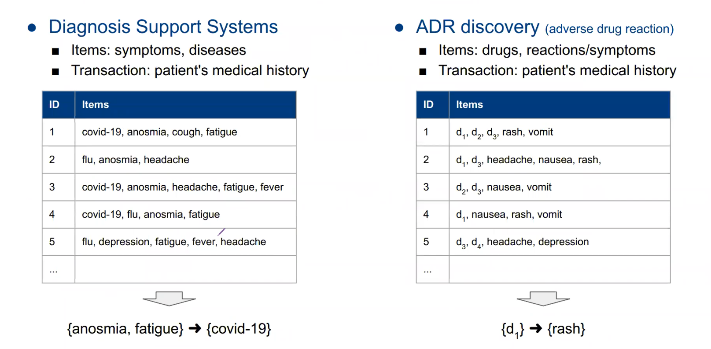
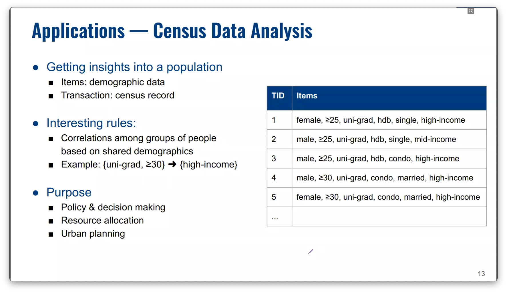

# Association rule mining

Suitable for nominal data?  

The goal of association rule mining is to find interesting or significant association rules and to find them efficiently.


Applications

- Market basket analysis
    - Shelf management, item placement. (put cereal and milk at opposite ends of NTUC to force people to chance upon other items)
    - Promotion bundles
    - Recommendations
    - Pricing strategies
- Medical data analysis
    
    Note that there are 2 types of items here.
    
    
    
- Census data analysis
    
    
    
- Behaviour data analysis
    
    
    

$d$ unique items result in $3^d - 2^{d+1} + 1$ possible rules[^allcombinations].
    

Definitions

$d$: no. of unique items

**Itemset;** $X$, $Y$: a subset of items

$X \rightarrow Y$: an association rule

$N$: no. of transactions

**Support count**: no. of transactions that *has* this itemset

**Support**: 

$$
\frac{support count}{N}
$$

**Frequent itemset**: itemsets with at least $minsup$ support

**Support of an association rule**:

$$
S(X \rightarrow Y) = \frac{S(X\cup Y)}{N}
$$

**Confidence of a rule**: 

$$
C(X \rightarrow Y) = \frac{S(X \rightarrow Y)}{S(X)}
$$

**Lift**:

$$
L(X \rightarrow Y) = \frac{S(X \cup Y)}{S(X) S(Y)}
$$

> 💡 A high support means that the itemset frequently appear together *historically*

> 💡 A high confidence means that if an itemset X appears, it usually appears with itemset Y

> 💡 If S({milk, bread}) = 10, then S({milk, bread, ...}) ≤ 10


## Brute force

$$O(3^d)$$

- Specify minimum confidence and minimum support.
- List all rules
- Drop rules that don't meet the requirement

## Apriori


Two-Part algorithm for mining association rules

1. Frequent itemset generation
    - Generate all possible itemsets
    - Drop itemsets that don't meet the `minSup` requirement
2. Association rule generation
    - Drop rules that don’t meet the the `minconf` requirement

---

[^allcombinations]: Explanation why $d$ unique items result in $3^d - 2^{d+1} + 1$ possible rules.

An item can be either be on the LHS, RHS or neither ("None").

```
Item 1: [LHS, RHS, None]
Item 2: [LHS, RHS, None]
Item 3: [LHS, RHS, None]
...
Item d: [LHS, RHS, None]
```

Any possible state can be obtained by drawing a path from one of the 3 states in Item 1 down to one of the 3 states in Item $d$. For $d=4$, a possible state is

`[LHS,None,RHS,RHS]`

which denotes `{1} -> {3,4}`.

First, we calculate the total number of possible states, which is  $3^d$. -- (1)

However, we should remove the states that are not allowed eg. `{} -> {3,4}`.

It is not possible to have only one side filled up, say only the RHS. For this to happen, an item is allowed to be in 2 different positions at a time (LHS and None). This gives us $2^d$ positions. -- (2)

```
Item 1: [LHS, None]
Item 2: [LHS, None]
Item 3: [LHS, None]
...
Item d: [LHS, None]
```

We repeat this for when items are only filled up on the LHS. This gives us $2^d$ positions. -- (3)

```
Item 1: [RHS, None]
Item 2: [RHS, None]
Item 3: [RHS, None]
...
Item d: [RHS, None]
```

Note that in the previous two cases, we eliminated a case twice -- the case where all items are None. So we will add 1 back. -- (4)

```
Item 1: None
Item 2: None
Item 3: None
...
Item d: None
```

Starting with the total possible states ($3^d$), we remove the states that cannot happen from the 3 cases above:

$$
\begin{aligned}
& 3^d - 2^d -2^d + 1 \\\\
&= 3^d - 2(2^d) + 1 \\\\
&= 3^d - 2^{d+1} + 1
\end{aligned}
$$