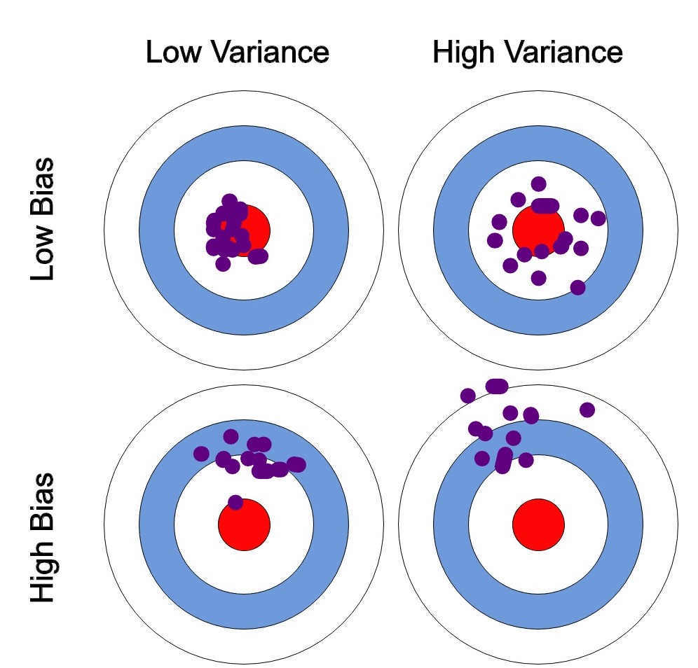
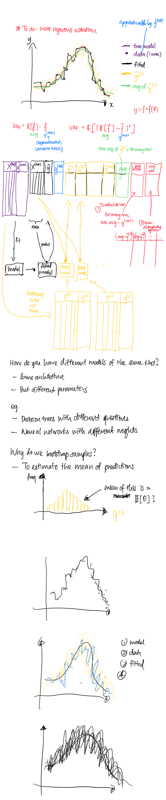

# Bias-variance decomposition

[https://scikit-learn.org/stable/auto_examples/ensemble/plot_bias_variance.html#sphx-glr-auto-examples-ensemble-plot-bias-variance-py](https://scikit-learn.org/stable/auto_examples/ensemble/plot_bias_variance.html#sphx-glr-auto-examples-ensemble-plot-bias-variance-py)

[http://rasbt.github.io/mlxtend/user_guide/evaluate/bias_variance_decomp/](http://rasbt.github.io/mlxtend/user_guide/evaluate/bias_variance_decomp/)

**Should use comparative adjectives like “larger bias”**

# **Why learn about bias and variance decomposition?**

A useful property of the mean squared error is that its expectation can be easily decomposed into bias and variance, which can be used to explain underfitting and overfitting. These values, although requiring true values, can be estimated, and give meaning to “closeness to true model” and “generalisability“.

# **What is?**

Expected MSE = Bias^2 + Variance + Var(noise)

# **Bias**

How different is our prediction and the real prediction, on average over bootstrap samples?

“Closeness to true model”

“Predictive power”

What we want is to see that these predictions are close to the true prediction across subsamples (“unseen data”) and different x inputs.

# **Variance**

How varied are our predictions, on average over bootstrap samples?

“Varying predictions across different subsamples“

“Generalisability”

“Consistency”

If this value is high, it means that, on the extreme case, all samples are very different from one another. One most plausible reason for this is that the model is overfitted to the dataset. What we want is to see that these predictions are consistently different (from the mean) across subsamples (“unseen data”) and different x inputs.

# **Variance of noise**

Irreducible part of the error, due to the variability in the data. Errors in measurement (“data collection”) can be tolerated, but inconsistent measurement errors cannot (?).

# **Case study: Single vs. Bagging**

Dark blue = model

Dark blue dotted = data = model + noise

Dark red = one fitted tree, trained over a training sample

Light red = other trees, trained over other and different randomly drawn instances of training samples

Cyan = Average of the estimators

1. Variance: How varied are the vertical width of light red (see x=2.4)
2. Bias: Difference between cyan and dark blue.

Top left:

Cyan ≈ dark blue -> low bias

Tall vertical shaded light reds -> large variance

Top right:

Cyan further from dark blue -> larger bias, see x=2.4

Shorter vertical shaded light reds -> lower variance

Workflow:

1. Calculate MSE to confirm intuition.
2. Conclusion: **The tradeoff is better for bagging** because averaging several decision trees fit on bootstrap copies
    1. Slightly increases the bias term, but
    2. Allows for a larger reduction of variance
3. Which results in a lower overall mean squared error.

# **Libraries**

from mlxtend.evaluate import bias_variance_decomp

