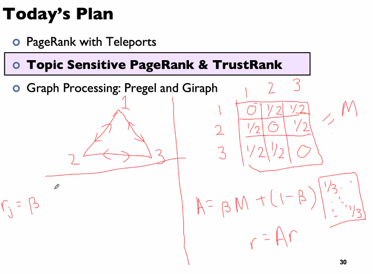
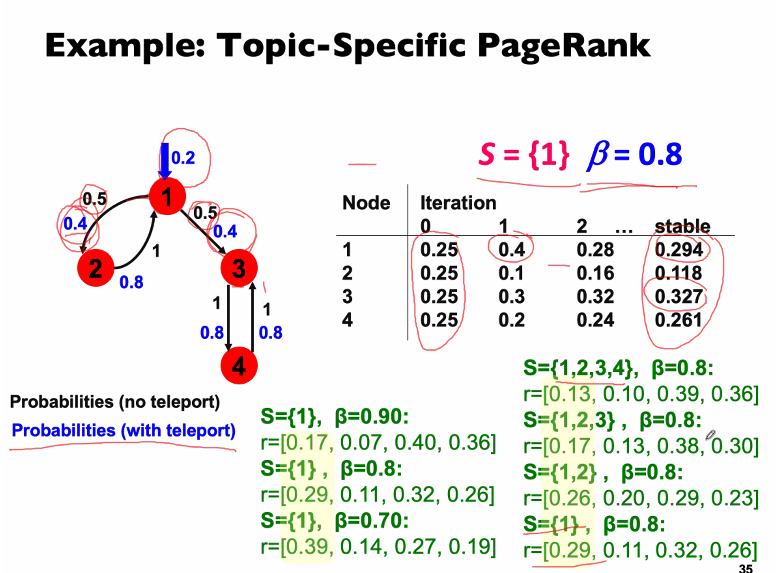

# PageRank

<!-- toc -->

---

## Importance

(aka "**rank**", "vote")

There are several ways to define importance of a page:

- no. of in-links to this page
    
    > ⚠️ susceptible to attacks
    
- (weighted) sum of importance of links to this page
    
    > 💡 recursive definition of importance
    
## PageRank

Properties of importance

- A vote from an important page is worth more
- A page that votes too many pages has a smaller vote

This recursive definition can be represented as

$$
r = M \cdot r
$$

and can be solved via **Power Iteration**.

Issues

Some issues that might not ensure convergence:

1. Spider trap
    
    At the end of the day we have
    
    ```python
    y   0
    a = 0
    m   1
    ```
    


1. Dead end
    
    At the end of the day we have
    
    ```python
    a   0
    b = 0
    ```
    


## PageRank with Teleports

$$
r = r \cdot A
$$

"Google Matrix A"

$$
A = \beta \cdot M + \frac{1}{N}(1-\beta) \cdot 1
$$

where the second term is a matrix

"Random teleport" as a solution for spider trap

dead ends → assign 1/N prob

Random teleport will ensure convergence to a stationary distribution.

Random teleport ensures that the Markov chain is not reducible.

> 💡 Recall that an irreducible Markov chain (can go from a state to *any* state) has a stationary probability distribution if and only if ALL of its states are positive recurrent.




## Topic-sensitive PageRank




"**teleport set"** is the set of pages of similar topic

## TrustRank

goal is to identify trusted vs untrusted pages.

this assumes that good pages only rarely link to bad pages.

start with a small set of trusted pages and propagate trust.

"**teleport set**" is the set of trusted pages
