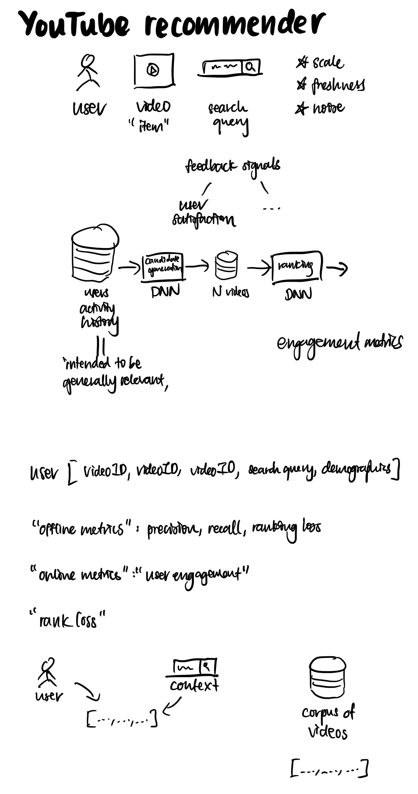
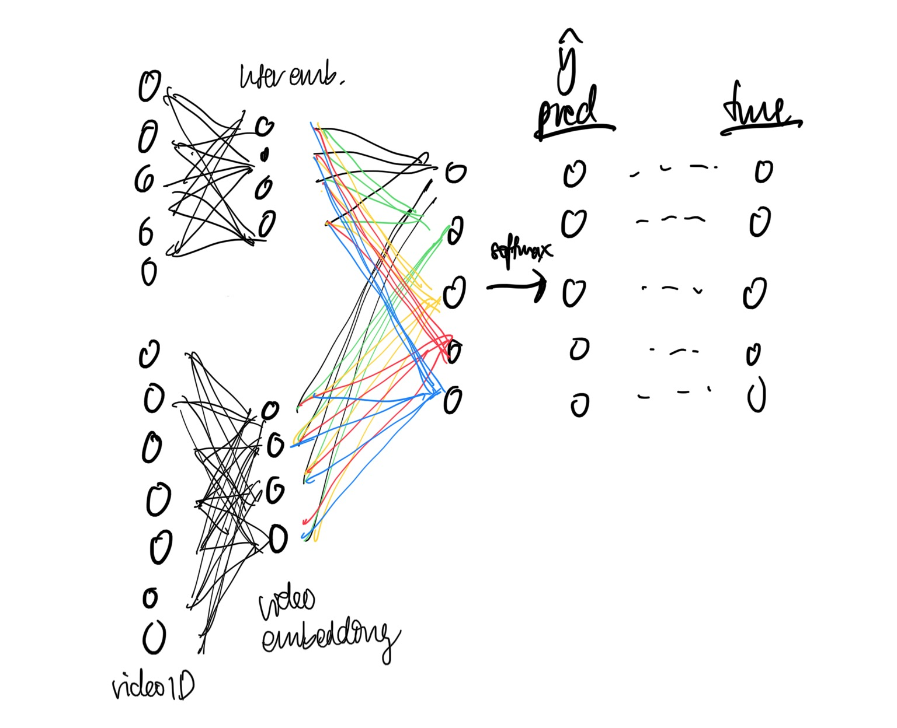

# YouTube

<!-- toc -->

---

## **Motivation**

“Discover personalised content from an ever-growing corpus of videos”

## **Data size**

“Hundreds of features”

- Users: 1B
    - ID
    - Metadata
        - Demographic features
        - Device
        - Geographic region
        - Device
        - Gender
        - Logged-in state
        - User language
        - Age
- Videos: “million”
    - Video ID
    - Video metadata (“impression data”)
        - Video language
        - Thumbnail image
        - …
- User profile
    - Watch history (aggregated from 50 recent videos)
    - Search history (aggregated from 50 recent searches)
    - Last search query
    - Time since last watch
- Feedback
    - Implicit
        - Watch (i.e. user completing a video; binary)
    - Explicit (sparse)
        - Activity history
        - Thumbs up/down
- Age of the training example as a feature*

## **Approach**

2-step approach allows them to make recommendations from a very large corpus of videos, while still being certain that the small number of videos appearing on the device are personalised and engaging for the user.

Predicting the next watched video.

## **Global video embedding**

No. of videos to use for embedding is top N by clicked impressions.

## **Candidate generation**

Hybrid though the paper labels it as collaborative filtering. Extreme multiclass classification.

Retrieval (under “tens of milliseconds”)

- Given a user as input, choose top N classes (videos)

**Ranking**

Logistic regression. Uses “hundreds of features”.

During retrieval, the list of videos is sorted by this score and returned to the user.

## **Metrics**

Development

During development, precision, recall, ranking loss etc. were used to guide iterative improvements to the models.

Final evaluation

For the final evaluation, A/B testing was used, relying on CTR, watch time, etc. via live experiments.

## **Learnings**

- Future leak
- Surrogate problem
    - Next watched video
- Train-test split
- Cold-start: demographic features as a prior
- Representing a temporal sequence of user actions

