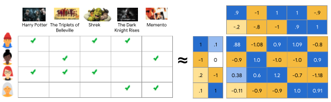
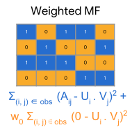
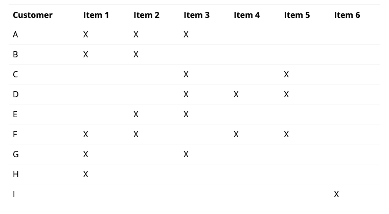
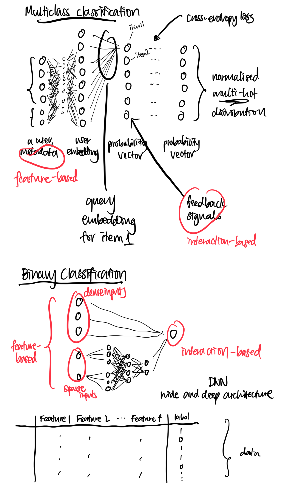
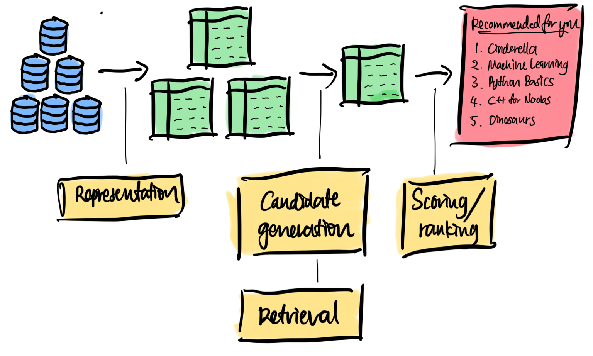

# Recsys

Recommender system, recommendation system

<!-- toc -->

---

Goal of recsys:

- Provide 'relevant' recommendations to users
- Balance between diversity, novelty and familiarity

**Motivation**

Having a recommendation system helps users find things they wouldn’t have to look for on their own.

# Libraries

[DLRM](https://github.com/facebookresearch/dlrm)

[Surprise](https://github.com/NicolasHug/Surprise)

[Microsoft Recommenders](https://github.com/microsoft/recommenders)

Implicit

DeepFM

LightFM - hybrid recommendation algorithm (3000)

[NeuRec](https://github.com/wubinzzu/NeuRec)

# Resources

[Google’s recommendation system course](https://developers.google.com/machine-learning/recommendation)

[https://blog.fastforwardlabs.com/2018/04/10/pytorch-for-recommenders-101.html](https://blog.fastforwardlabs.com/2018/04/10/pytorch-for-recommenders-101.html) (Collaborative filtering using supervised learning and DNN)

[https://www.ethanrosenthal.com/2017/06/20/matrix-factorization-in-pytorch/](https://www.ethanrosenthal.com/2017/06/20/matrix-factorization-in-pytorch/)

[https://blog.fennel.ai/p/real-world-recommendation-system?s=r](https://blog.fennel.ai/p/real-world-recommendation-system?s=r)

# **Terminology**

“Dense features” - watch time, time since last watch, …

“Sparse features” - watch history, country, …

“Side features” - user metadata, …

“Factors” - embedding size

# Data

## Types of interaction / feedback

### Implicit feedback

- Click
- Purchase
- Follow
- Duration of consumption

indirectly reflect opinion by observing user behaviour including purchase history, browsing history (ALS is good).

Classification problem.

- How recent?
- Downloaded or not?
- Synopsis / reviews of books?

### Explicit feedback

- Rating (star ratings eg. GoodReads, MovieLens, Amazon)
- Review
- Vote
- Continuous scale
- Pairwise preference (if you like one product X over another product Y)
- Temporary (eg. Pandora 30-day suspend)

(aka ratings) explicit input by users regarding their interest in product.

Regression problem.

- During or immediately after consumption
- Some time after the experience

Difficulties with ratings

- Ratings might not be reliable because users might not express their preference well on the scale. If you asked someone to re-rate, their rating will change.
- Ever-changing users (helping to borrow book for another person).
- User preference can change.
- What does a rating mean?

## **Train-test split**

- Mask out some parts of entries in the feedback matrix
- Leave-one-out
Hold out the most recent transaction of each user
- Time series split:
Split the whole dataset according to time sequence, and hold out the newer transactions based. On a cut-off date
- Split by user:
Hold our certain user’s transaction data
- Sliding window

# Methods

## Content-based filtering

My own alias: "feature-based filtering"

When recommending for a user, one can:

- compute the similarity between a user embedding and all other item embeddings
- compute the similarity between an item embedding and all other item embeddings. These items can come from a user's history.

and return the closest items.

## Collaborative **filtering**

interaction-only filtering

My own alias: "interaction-based filtering"

Types:

- Neighbourhood-based methods (similarity based)
    - Item-based, user-based
- Latent factor models
    - Matrix factorisation
    - Supervised learning

Collaborative filtering uses similarities/interactions/feedback signals between users and items simultaneously to provide recommendations (in a more supervised manner). This requires

- Feedback signals (labels) that indicate if a user has interacted with an item.

Collaborative here refers to interaction between user and item.

During retrieval, an embedding of a user or item is obtained, which is then used to find similar users or items.

## **Matrix factorisation**

MSE = rating - predicted rating,           where predictedrating = global avg + item bias + user-item interaction

Objective functions: MSE, Frobenius distance

Optimisers: ****SVD, PCA, NMF, SGD, ALS (alternating least squares)

Cons: Cold-start problem - during retrieval, a new item does not have an assigned embedding.

During retrieval, user embedding can be looked up from user embedding matrix.

..............

[https://developers.google.com/machine-learning/recommendation/collaborative/matrix](https://developers.google.com/machine-learning/recommendation/collaborative/matrix)

Matrix factorisation is an embedding model where it learns $U$ and $V$ such that the 

$$
UV^T \approx A
$$

**Objectives**

There are several objective functions (to be minimised) to choose from:

- Frobenius norm
    
    For the first entry in the matrix, take the squared difference between true and predicted. Repeat the same for all other entries. Finally sum all these squared differences. Treat unobserved as zeros.
    
    $$
    \sum_{i,j}(y_{i,j}-\hat{y}_{i,j})^2
    $$
    
- Observed-only MF
    
    Only consider observed values.
    
    $$
    \sum_{i,j} (y_{i,j}^\text{(observed)}-\hat{y}_{i,j}^\text{(observed)})^2
    $$
    
    
    
- Weighted MF
    
    $$
    \sum(y^\text{(observed)}-\hat{y}^\text{(observed)})^2 + w(0-\hat{y}^\text{(unobserved)})^2
    $$
    
    Sometimes you also need to weight the observed pairs:
    
    $$
    \sum w^\text{(observed)}(y^\text{(observed)}-\hat{y}^\text{(observed)})^2 + w^\text{(unobserved)}(0-\hat{y}^\text{(unobserved)})^2
    $$
    
    
    

**Optimisers** 

- SGD
    1. Initialise embeddings to $$Uniform(1,\frac{1}{\sqrt{K}})$$ where K is no. of features
- Weighted ALS
    1. Initialise embeddings randomly.
    2. Alternate between (i) fixing $U$ and solving $V$, and (ii) fixing $V$ and solving $U$. Each stage can be solved exactly via OLS. 
    
    > ⚠️ Only for objective functions that are squared loss.
    
- SVD
    
    Not good if $A$ is very sparse. (Why?)
    
- Coordinate descent
- Conjugate gradient

Embeddings ($U$ and $V$) are initialised randomly.

### Item-based collaborative filtering

1. Create interaction matrix
    
    
    
2. Create item-item similarity based on interaction matrix.
    
    
    
3. Recommend:
    - Customer B: Item 3
    - Customer C: Item 4, Item 2. Item 5 is similar to Item 4 (similarity value: 0.82). Item 2 is similar to Item 3 (similarity value: 0.45).

### **Neighbourhood methods based on feedback matrix**

Get k most similar users to the user, recommend new items.

### **Supervised learning**

Neural collaborative filtering

## Hybrid

"feature-and-interaction filtering"

Combination of content-based and collaborative filtering

Uses both

1. Features of
    - Users
    - Items
2. Interactions between users and items

### S**upervised learning**

Can be framed as binary classification or multiclass classification.

During retrieval, ???

### **LTR**

LTR trains a model to directly predict the probability of a certain item ranking over another item.

### **Factorisation machine**

A generalisation of matrix factorisation that allows use of item and user metadata, and feedback signals. It models the interaction between user and item with higher-order dimensions. This is in contrast to Matrix Factorisation, where interaction is modelled as dot-product.

$$
f(x) = w_0 + \sum_{p=1}^P w_p x_p + \sum_{p=1}^{P-1} \sum_{q=P+1}^P w_{p,q} x_p x_q
$$

## **Retrieval**

One can think of the embedding space as an abstract representation common to both users and items, in which we can measure the notion of closeness or relevance using similarity metric.

- Cosine
- Euclidean
- Dot product

At inference time,

1. Look up embedding of input
    - If input is a user/query, look up its embedding.
    - If input is an item, look up its embedding.
2. Select top k nearest neighbours. One may consider using approximate nearest neighbours for large corpora.

# **Metrics**

Accuracy: How similar are the recommendations compared to previous interactions?

Diversity: How dissimilar are the recommendations?

Coverage: What % of the user-item space are recommended?

Serendipity: How surprising are the relevant recommendations?

Novelty: How surprising are the recommendations in general?

Relevancy: How relevant are the recommendations?

# Tricks

- 2-stage:
    - Stage 1: Candidate generation
    - Stage 2: Ranking

- Banding
    
    The top predictions are what the user has already read. But we don't want that. Instead it is customary to use the 70% percentile onwards.

# Case studies

- [YouTube](https://research.google/pubs/pub45530/)
- [Instagram Explore](https://instagram-engineering.com/powered-by-ai-instagrams-explore-recommender-system-7ca901d2a882)
- [Airbnb Experiences](https://medium.com/airbnb-engineering/machine-learning-powered-search-ranking-of-airbnb-experiences-110b4b1a0789)
