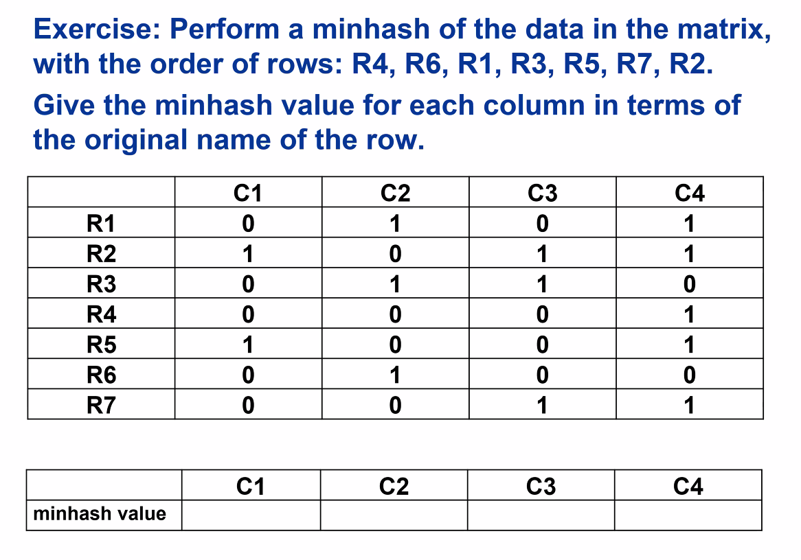
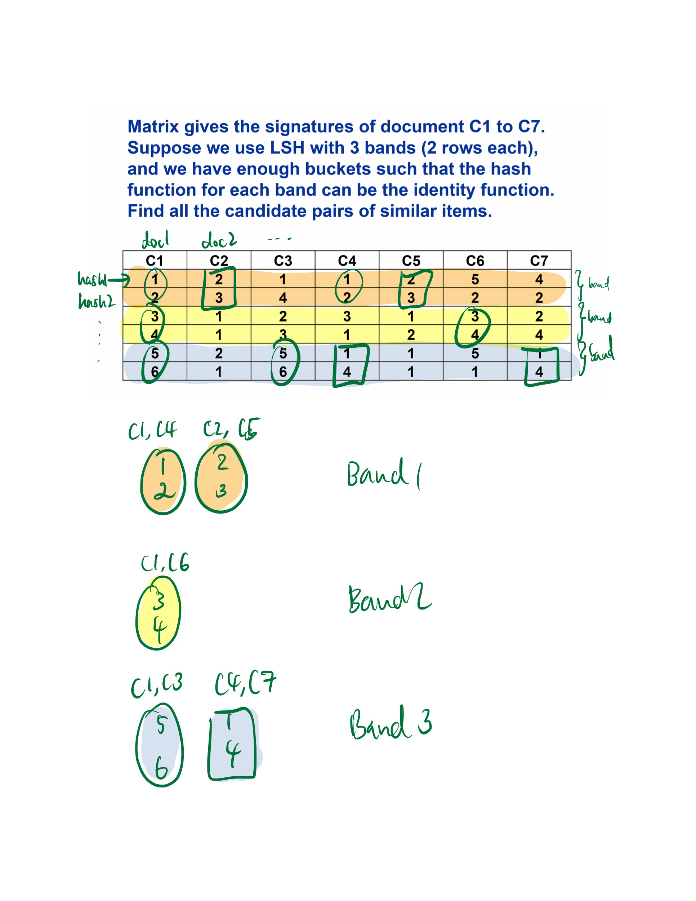

# Similar items

## Brute force

## LSH

- Jaccard similarity
    
    
- Shingling
    
    document → {(xx,ds), (ds,4), }
    
    <aside>
    💡 Shingles (k-grams) account for order
    
    </aside>
    
    O(n(n-1)/2)
    
    compressing shingles
    
    ```python
    abcab -shingle-> {ab,bc,ca} -hash-> {1, 5, 7}
    ```
    
- Min-hashing
    
    convert large set to short signatures while preserving similarity
    document → f4fca09
    
- Locality-Sensitivity Hashing



R5; R6; R3; R4


