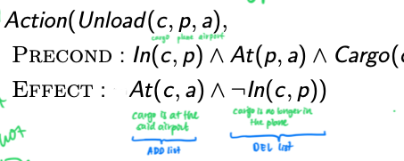

# Classical planning (uaing state-space search)

<!-- toc -->

---

Classical planning agents represent states and their transitions using a factored representation. 

AIAMA calls these agents as "planning agents."

A **state** is represented using a set of **state variables** or **fluents**. eg. 

```
{
    At(plane1, time1) = True,
    At(plane2, time2 = True,
    At(plane1, time2 = True
}
```

Planning becomes a state-space search. Note that states are transformed via operators (actions). 

## Languages

Languages used in classical planning:

- PDDL
    
    Domain
    
    > 💡 "Plan once, run everywhere".  A domain is a greater problem, defining the 'world'. In this world, you define entities ("types") like places, vehicles, general objects. You also define yes/no statements ("predicates") in combination with the instances of the types. Lastly, you define the things that you can do ("actions") that can be taken in this world.
    
    - Requirements
        
        ```
        (:requirements :strips :typing)
        ```
        
    - Types
        
        ```
        (:types city place physobj - object
                  package vehicle - physobj
                  truck airplane - vehicle
                  airport location - place
        )
        ```
        
    - Predicates
        
        ```
        (:predicates (in-city ?loc - place ?city - city)
        	     (at ?obj - physobj ?loc - place)
        	     (in ?pkg - package ?veh - vehicle))
        ```
        
    - Actions
        
        ```
        (:action load-airplane
           :parameters (?pkg - package ?airplane - airplane ?loc - place)
           :precondition (and (at ?pkg ?loc) (at ?airplane ?loc))
           :effect (and (not (at ?pkg ?loc)) (in ?pkg ?airplane))
        )
        
        (:action unload-truck
           :parameters (?pkg - package ?truck - truck ?loc - place)
           :precondition (and (at ?truck ?loc) (in ?pkg ?truck))
           :effect (and (not (in ?pkg ?truck)) (at ?pkg ?loc))
        )
        ```
        
    
    Problem
    
    > 💡 A problem is a real problem to solve. A real problem is defined by its goal ("goal") and how things are looking currently ("initial state"). You also specify instances of the types ("objects") like "London" if the type is *location*.
    
    
    - Goal
        
        ```
        (:goal (and (at p1 north) 
                    (at p2 south))
        )
        ```
        
    - Initial state
        
        Ground predicates that are positive only
        
        ```
        (:init (in-city cdg paris)
               (in-city lhr london)
               (in-city north paris)
               (in-city south paris)
               (at plane lhr)
               (at truck cdg)
               (at p1 lhr)
               (at p2 lhr)
          )
        ```
        
    - Objects
        
        ```
        (:objects plane - airplane
                  truck - truck
                  cdg lhr - airport
                  south north - location
                  paris london - city
                  p1 p2 - package)
        ```
        
- STRIPS
    - Actions in a state
        
        ```
        Action(Load(c,p,a)
        	Precond: At(c,a) ∧ At(p,a)
        	Effect: ¬At(c,a) ∧ ... )
        ```
        
    - Initial state
        
        ```
        Init(At(...) ∧ Heigh(...))
        ```
        
    - Goal
        
        ```
        Goal(At(...) ∧ Heigh(...))
        ```
        
- SATS
    - Propositionalise the actions
    - Initial state
        
        Instead of
        
        $$
        At(P_1,SFO), At(P_2,JFK)
        $$
        
        assert *every* fluent.
        
        $$
        Assert: At(P_1,SFO)^0, At(P_2,JFK)^0, \neg At(P_1,JFK)^0, \neg At(P_2,SFO)^0
        $$
        
    - Propositionalise the goal
    - Add successor-state axioms
    - Add precondition axioms
    - Add action exclusion axioms

> 💡 **Why is dropping negative effects (in preconditions) better?**
It becomes easier to achieve all goal literals because preconditions are easier to meet. It becomes a relaxes problem because a plan in the original problem is also a valid plan in the transformed problem.

ADD list and DEL list



**Heuristics**

- Ignore delete lists
- Ignore preconditions
- Decompose problem into subproblems

How to reformulate problem

1. Create the new type if needed. Eg. `time`.
2. Add predicate to indicate where we are in wrt to the new type. Eg. `at_time(t1)`. Add predicate to move between the objects (that will always be true). Eg. `time_next(t1 t2)`.
3. Update actions to include these. 
4. Create the objects if they don’t already exist. Eg. `t1 t2 t3 - time`.  
5. Update the initial state to include rules to guide the planner how to navigate in the search space. Eg. `time_next(t1 t2) time_next(t2 t3)`


## Algorithms

### Forward search

AKA forward state-space search

Examples: [Fast Downward](http://www.fast-downward.org/)

### Backward search

AKA backward relevant-states search

"Regression"

Only consider actions that are relevant to the goal  or current state.

To regress from goal $g$ to a description $g'$,

$$
g'=(g-ADD(a)) \cup Precond(a)
$$

### Boolean satisfiability

NP-complete algorithm

At time step 1, set a set of boolean variables. Through axioms (if the set of bools is like this then go this, else go there), you move to the next step. Repeat until you have all True. The plan is the different sets of bools for each time step. The solution is setting the right actions.

### Graphplan

This uses a planning graph data structure. It works only for *propositional planning problems* (no variables, only literals).

Like the normal graph but include mutually exclusive actions and propositions. Then start searching from the goal. 

- Heuristics that can be derived from planning graph:
    - 1 goal
        - Cost of achieving any goal literal (can be estimated from the level in which it first appears)
    - Conjunction of goals
        - Max-level (take the max of the levels of the goals)
        - Level sum (take the sum of the levels of the goals). Can be inadmissible.
        - Set level
