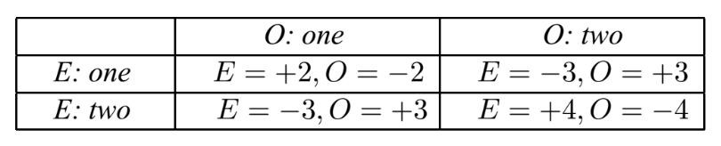

# Single-move / simultaneous games

Defined by

1. Players/agents
2. Actions
3. Utility ("**payoff**") function (strategic form or normal form)
    
    
    

Each player adopts and executes a policy ("**strategy**"):

- Pure strategy: deterministic
- Mixed strategy: randomised based on a probability distribution

Each player is then assigned a strategy ("**strategy profile**").

When each player adopts a rational strategy, then we call it a **solution.**

When each player has a dominant strategy, we call it a dominant strategy equilibrium.

Prisoner's dilemma: it's a dilemma because they should’ve chosen (refuse, refuse) instead of (testify, testify) where they are both rational.

**Nash equilibrium** is when changing strategy doesn't make it better (?)

To test if at equilibrium, fix all except one, see if changing strategy will improve

There will always be an equilibrium is players adopt mixed strategy.

> 💡 Strategy ≈ policy ≈ solution

Players can play games that can be characterised by:

- No. of players
- If payoffs sum to 0
- If players adopt pure or mixed strategies

Our goal is to find a Nash equilibrium because that's what rational agents should do otherwise they'll lose out. The following are ways to find the Nash equilibrium depending on the situation:
