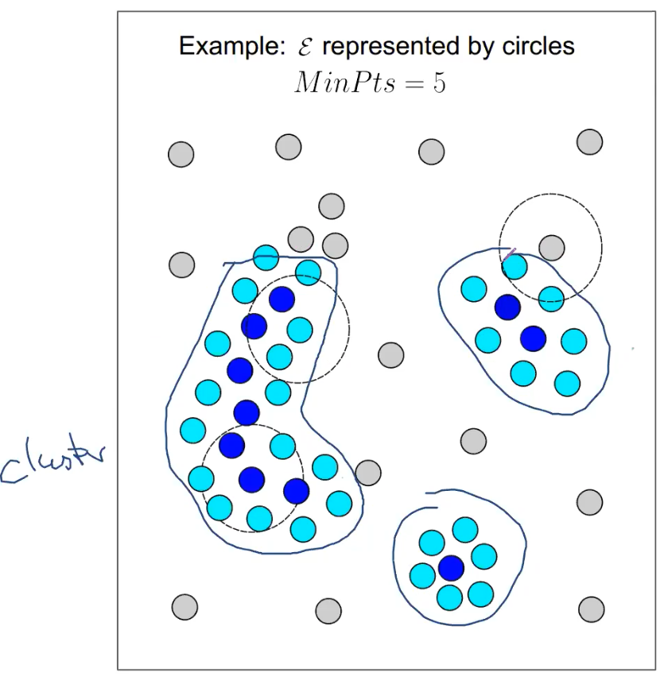
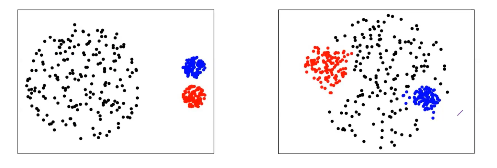
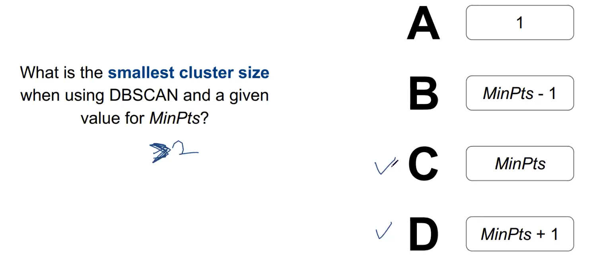
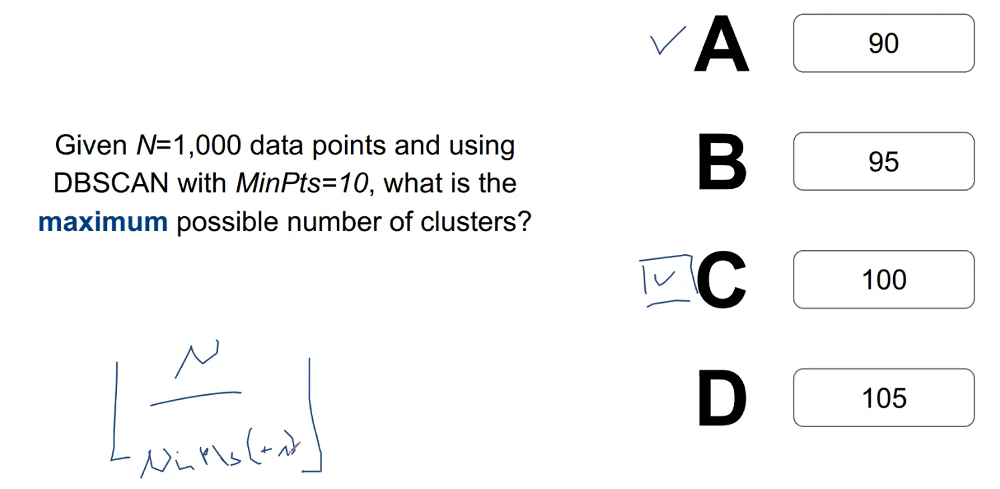
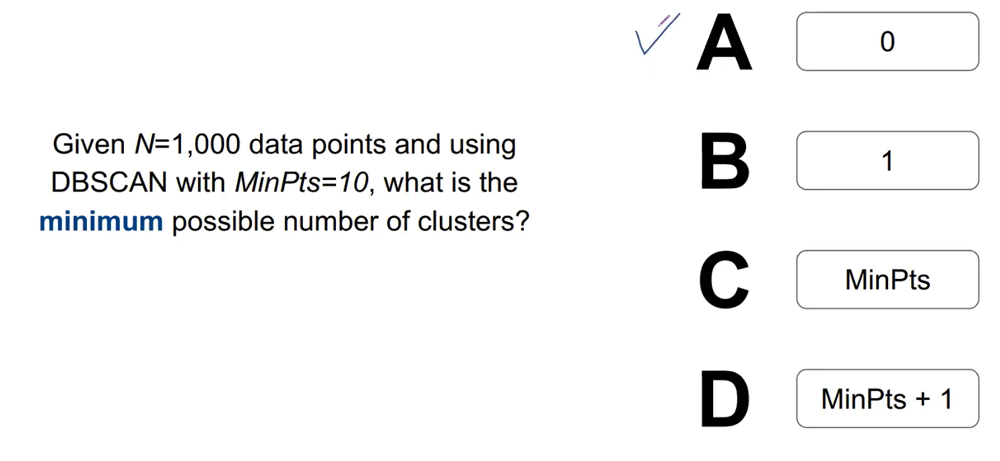
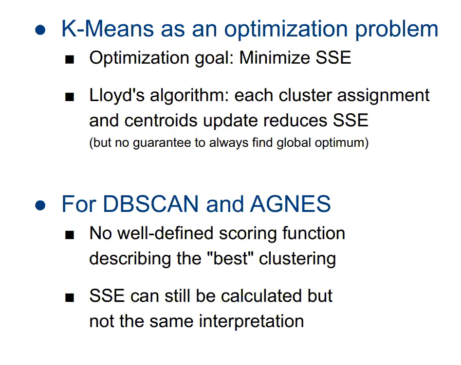

# DBSCAN

Density-based spatial clustering of applications with noise

**#nonparametric** **#nonprobabilistic**

<!-- toc -->

---

The DBSCAN algorithm views clusters as areas of high density separated by areas of low density.

1. Choose 2 numbers: max_distance, min_points
2. Pick a random datapoint. This is cluster A
3. Criteria for datapoints to be in this cluster:
    1. They are within a distance of max_distance
    2. There are more than min_points datapoints
4. Once run out of points, find another datapoint that has no cluster. This is Cluster B.

## From CS5228:

$O(MinPts \times N)$

Clusters: **density-based**

Clustering: partitional, exclusive, **partial**

$$
density = \frac{mass}{valume} \approx \frac{MinPts}{\epsilon}
$$

where $\epsilon$ is the radius defining no. of points in the neighbourhood and $MinPts$ the min. no. of points for it to be a core point.

There are 3 types of points:

- Core points: Any points with at least MinPts neighours in a radius $\epsilon$.
- Border points: Any non-core points with at least one core point within the radius $\epsilon$.
- Outliers

Algorithm:

1. Repeat
    1. Pick a random unexplored point x.
    2. If x is not a core point, label as noise (might change later). 
    
    Until x is a core point
    
2. Then explore this new cluster starting from this core point. 
    - A neighbour of a cluster is never a noise.
    - Do for all neighbours
    - Exploration stops once there are no more core points.
    
    
    

> 💡 Note that a noise point can become a border point.

- Always converges
- Cannot handle different densities
    
    
    
- Very sensitive to parameters
    
    
    
    Parameters can be chosen by
    
    - EDA: plot distribution of all pairwise distances. This can help us to decide suitable values for $\epsilon$.
        
        
        
    - Intuitive semantic meaning of $MinPts$.

### Quiz

### Review

