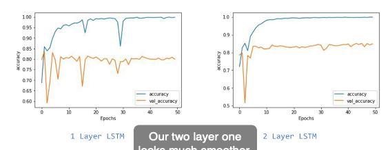
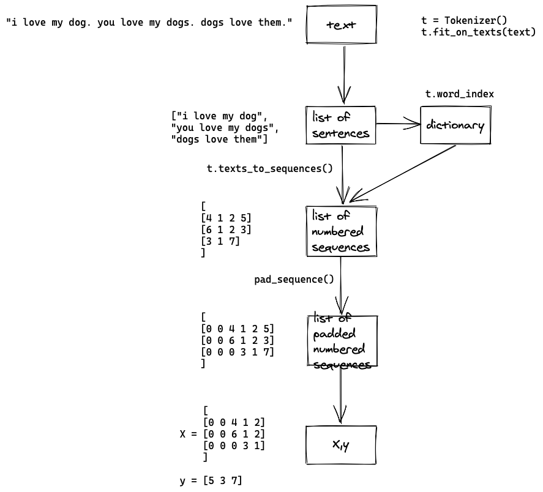
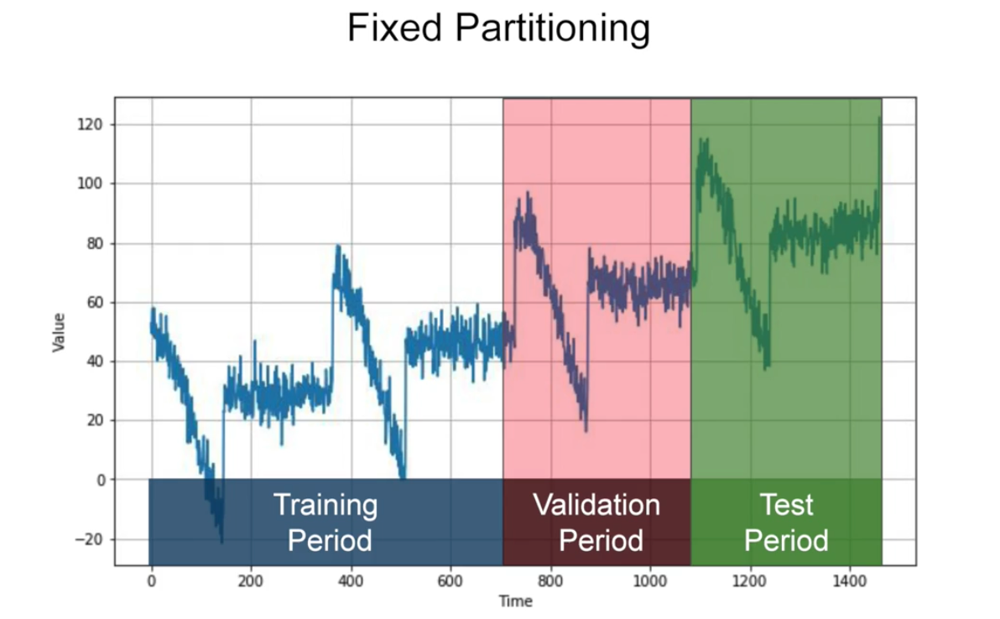

# Coursera


# Bonus questions

- What is convergence?
    
    The process of getting close to an answer
    
- What is a loss function?
    
    Measures how far you are from the current guess
    
- What does the optimiser do?
    
    Generates a new and improved guess
    
- Why split data into training and test?
    
    To test a model with previously unseen data
    
- Why is overfitting more likely to occur on smaller datasets?
    
    Because there's less likelihood of all possible features being encountered in the training process.
    
- Why is the validation accuracy a better indicator of model performance than training accuracy?
    
    The validation accuracy is based on images that the model hasn't been trained with, and thus a better indicator of how the model will perform with new images.
    
- What does a slow decline of validation accuracy and incline in train accuracy on the plot indicate?
    
    Overfitting.
    
- Why do dropouts help overfitting?
    
    Because neighbour neurons can have similar weights and thus can skew the final training
    
- What could be the reason behind jaggedness and sudden dips in accuracy graph?
    
    
    
    The model needs improvement (need it to be more complex).
    

# Computer vision

Computer vision is the field of having a computer understand and label what is present in an image.

- What is convolution?
    
    A technique to isolate features in images.
    
- What is pooling?
    
    A technique to reduce information in an image while maintaining features.
    
- How do convolutions improve image recognition?
    
    They isolate features in images.
    
- Why is transferring learning useful?
    
    Because I can use the features that were learned from large data sets that I may not have access to
    

## Improving speed of training

Reduce image size by half

## Improving accuracy

### Visual

Visually inspect images that are wrongly classified, and use these and include them in the training. The model is not exposed to that kind of image so just add it to the training set.

### Cropping the wrong images.

### Augmentation

Image augmentation introduces a random element to the training images. But if the validation set doesn't have the same randomness, that the validation accuracy can fluctuate.

## Overfitting

- Augmentation
- Dropout
- ! Validation data should not be augmented

# NLP

- Subwords must be used with recurrent neural networks. Why?
    
    Sequence becomes much more important when dealing with subwords, but we're ignoring word positions.
    
- Why would you get more overfitting in NLP?
    
    Because you always always have OOV in the validation data set (the training data has never seen them). 
    
- Why does sequence make a large difference when determining semantics of language?
    
    Because the order in which words appear dictate their impact on the meaning of the sentence.
    
- In a generative text model, why and what would you do if the word keeps repeating itself?
    
    The RNN only carries the context forward. Change the RNN to be bidirectional.
    
- When predicting word to generate poetry, the more words predicted the more likely it will end up gibberish. Why?
    
    Because the probability that each word matches an existing phrase goes down the more words you create.
    



## Prepare data

```python
corpus = [
	"I love my dog", 
	"I love my cat", 
	"You love my dog!"
]
```

- tokenising
- OOV
- convert a text to numbers
- padding
- sequences

```python
from tf.keras.preprocessing.text import Tokenizer
t = Tokenizer(num_words=100, oov_token="<OOV>")
t.fit_on_texts(corpus)
```

<aside>
⚠️ The resulting `word_index` is not affected by the `num_words` parameter. This parameter will only take effect when calling `texts_to_sequences`.

</aside>

```python
>>> t.word_index
{'<OOV>': 1,
 'twinkle': 2,
 'little': 3,
 ...
```

```python
>>> t.texts_to_sequences(["i love manatees"])
[[4, 2, 1]]
```

```python
>>> pad_sequences(
			t.texts_to_sequences(["i", "i you you you"]),
			padding='pre', # post
			maxlen=None)
array([[0, 0, 0, 4],
       [4, 7, 7, 7]], dtype=int32)
```

## Prepare for text classification

Prepare X and y

## Prepare for next-word prediction

Get ngram sequence

```python
input_sequences = []
for line in corpus:
	token_list = t.texts_to_sequences([line])[0]
	for i in range(1, len(token_list)):
		ngram_sequence = token_list[:i+1]
		input_sequences.append(ngram_sequence)
```

```python
>>> input_sequences
[[1, 1],
 [1, 1, 2],
 [1, 1, 2, 3],
 ...
```

```python
max_sequence_len = max([len(x) for x in input_sequences])
input_sequences = np.array(pad_sequences(
	input_sequences, maxlen=max_sequence_len))
```

```python
>>> input_sequences
array([[ 0,  0,  0,  0,  1,  1],
       [ 0,  0,  0,  1,  1,  2],
       [ 0,  0,  1,  1,  2,  3],
			 ...
```

```python
X, y = input_sequences[:,:-1], input_sequences[:,-1]
y = tf.keras.utils.to_categorical(y, num_classes=total_words)
```

## Modelling

- CNN. Can use Conv1D then GlobalAveragePooling1D
- Sequence modelling
    
    Cell state in RNNs is akin to context. Context should be updated and retained throughout the sequence of words.
    

# Time series

1. Prediction
2. Imputation
3. Detect anomalies

## Common patterns in time series

- Trends
- Seasonality
- Autocorrelation



## Method: Moving average

eliminates noise, but does not anticipate trend or seasonality

## Method: Differencing

$$
series(t) - series(t-365)
$$
