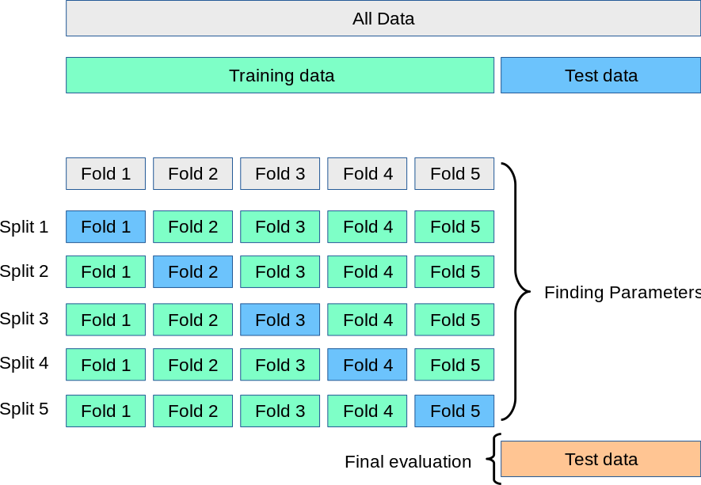

# Cross validation

A way to evaluate the model performance.

Define no. of splits = 5 (5-fold)

```python
skf = StratifiedKFold(n_splits=5) # 5-fold
folds = skf.split(X, y)

accuracies = []
for fold in folds:
	model.fit()
	acc = model.score()
	accuracies.append(acc)

mean(accuracies)
```


