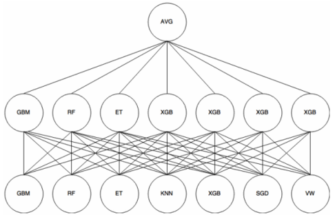

# Ensembling

“Ensemble” here is an umbrella term that trains several models

<!-- toc -->

---

[http://www.ccs.neu.edu/home/vip/teach/MLcourse/4_boosting/slides/gradient_boosting.pdf](http://www.ccs.neu.edu/home/vip/teach/MLcourse/4_boosting/slides/gradient_boosting.pdf)

# **Ensemble learning**

Ensemble methods (“bagging” and “boosting” are misnomers):

- Bagging (“create new models by bagging training sample”)
- Boosting (“create new models by boosting a previous model”)

Aggregating methods for predictions:

- Classification
    - Max / majority / hard voting
    - Soft voting
- Regression
    - Average
    - Weighted

“Bagging” = ensemble learning based on bootstrapping (“bootstrap aggregating”)

“Bootstrapping” = sampling technique

“Aggregating” = can mean “bagging” or “boosting” in this context

“Boosting” = a sequential process where each subsequent model attempts to correct the errors of the previous model

OR

ensemble method that seeks to create a strong classifier (model) based on “weak” classifiers

- How many trg examples to sample
- How many features to select
- How to select thresholds
- When to stop splitting

## **Simple bagging**

Individual model: decision tree

1. Sample with replacement 50 training examples (“bagging”)
2. Train a tree
    - Try a split for:
        - Every feature
            - Every possible threshold in every feature
3. Repeat teps 1-2 for 1000 times
4. Aggregate predictions

## **Random forest**

Individual model: decision tree

1. Sample with replacement 50 training examples (“bagging”)
2. Train a tree
    - Try a split for:
        - Every feature in sqrt(p) out of p features (“feature bagging”)
            - Every possible threshold in every feature
3. Repeat steps 1-2 for 1000 times
4. Aggregate predictions

## **ExtraTrees (Extremely randomised trees)**

Individual model: decision tree

1. Take all training examples
2. Train a tree
    - Try a split for:
        - Every feature in sqrt(p) out of p features (“feature bagging”)
            - A random point (uniform distribution) in every feature
3. Repeat steps 1-2 1000 times
4. Aggregate predictions

## **AdaBoost**

AKA Adaptive Boosting

Individual model: decision tree

Quasi gradient boost with weights

- Depth
- Weight of datapoint
- Amount_of_say

The idea is to set weights to classifiers and samples in a way that forces classifiers to concentrate on observations that are too difficult to correctly classify

1. Initialise weights of each data point. If there are 100 data points, each point is 0.01
2. Sample with replacement all training examples (same size)
    - Using the weights as categorical distribution of choosing data
    - Then reset weights
3. Train a tree with depth=2
4. Calculate this tree’s final say during aggregation
    - Error rate, e = ???
    - Say = 1/2 log ((1-e)/e)
5. Update weights
    - If correct, (almost) no change
    - if wrong, new weight = old weight * exp(say)
6. Normalise weights
7. Repeat 1000 times (from step 2)
8. Aggregate predictions using amount_of_say (do weighted sum)

## **GBM**

Gradient Boosting

Individual model: decision tree

1. Sample with replacement ("bagging")
2. Train a tree
    - Try a split for:
        - Every feature ?
            - Every point?
    
    by fitting model
    
    1. pred_y = tree1.predict(data)
    2. residual_error_1 = actual_y - pred_y
    3. tree2.fit(residual_error_1)
3. Repeat steps 1-2 for 1000 times.

Boosting trees sequentially add predictors and corrects previous models. This method fits the new model to new residuals of the previous prediction and then minimises the loss when adding the latest prediction.

### **XGBoost**

Optimisations

1. To find thresholds, they use pre-sort-based algorithm
    - Using a subset of data available the node, bin features into histograms

### **LightGBM**

Optimisations

1. To find thresholds, they use histogram-based algorithm which buckets continuous features.
2. Build tree in depth-first.
3. Improved split strategy.
4. Improved splitting for categorical features.
5. Supports NaNs.

### **Histogram-based gradient boosting**

Optimisations

1. To find thresholds, they use histogram-based algorithm which buckets continuous features. Faster than normal for n_samples > 10,000.
2. Native support for NaNs.

### **CatBoost**

Optimisations

1. To find thresholds, they use histogram-based algorithm which buckets continuous features.

### Forest Inference Library by rapids.ai

# **Simple ensembling**

Aggregate predictions of different models

# **Stacking & blending**

Everyone says different things.

**Meta-meta-estimator**

**Blending**

Linear combination of predictors

**Neural network estimator ish**

Stacking and blending differ by the type of folds in the cross validation used during training of each layer
