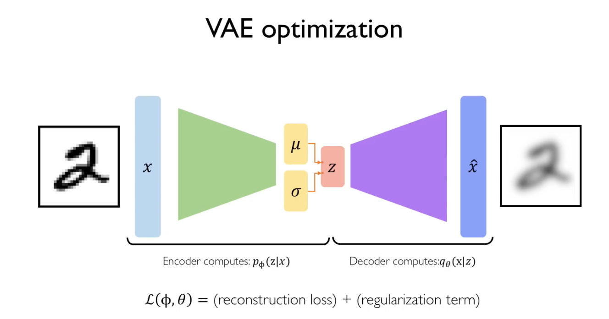
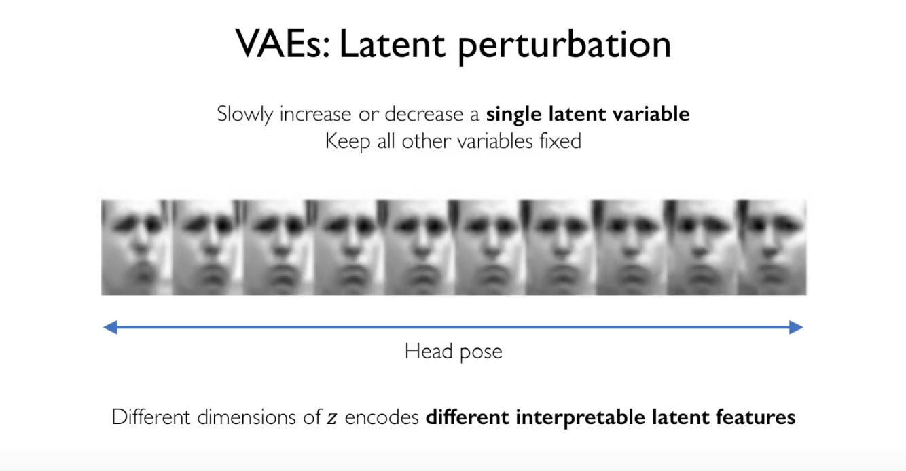

# VAE

Variational autoencoder

Instead of learning a deterministic latent vector z, we learn a vector of mean and a vector std that parametrise the probability distribution for each of the latent variables

