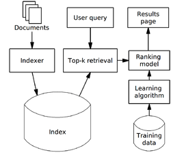

# Information retrieval

Information retrieval is the activity of obtaining [information system](https://en.m.wikipedia.org/wiki/Information_system) resources that are relevant to an information need from a collection of those resources.

<aside>
💡 **Hows it different from database search?**
The ranking of results is a key difference of information retrieval searching compared to database searching.

</aside>

Examples of IR applications:

- web search engine

Keywords

- Queries
- Term
- Document
- Index
- Inverted index — Map<Term, Document>

For effectively retrieving relevant documents by IR strategies, the documents are typically transformed into a suitable representation based on a model.

- Boolean models — [ 0 1 0 0 1 ]
- Vector space model — [ 0.54 0.99 0.91 0.21 ]
    - TF-IDF (popular)
- Probabilistic models
    
    LDA
    

# PageRank

(Initial) transition probabilities of websiteX to websiteY

| w1 | W2 | W3 | w4 |
| --- | --- | --- | --- |
| 0 | 0.3 | 0.3 | 0.3 |
| 0.5 | 0 | 0.5 | 0 |
| 0 | 0 | 0 | 0 |
| 0 | 0 | 0 | 0 |

P(W2|W1)=0.3

Traditional information retrieval uses 

- query expansion to disambiguate terms in a search query
- n-gram term matching

Terms

- vector space model
