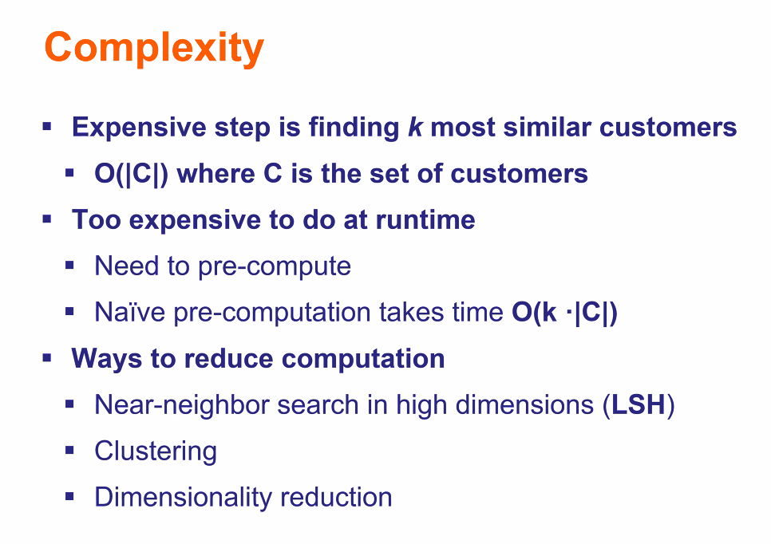
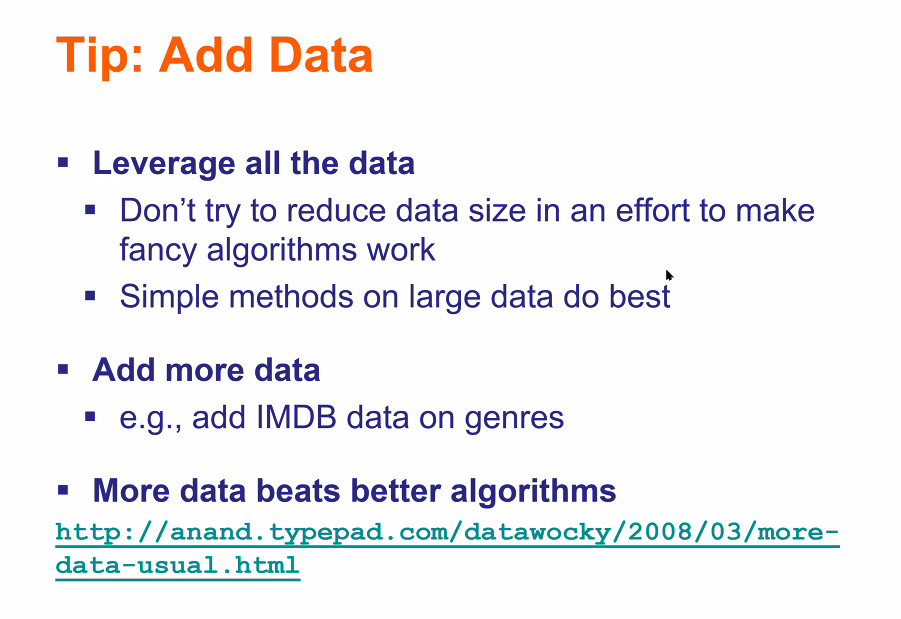

# Recsys

<!-- toc -->

---

## Content-based

Complexity: $O(N)$ where $N$ is the no. of users

- Item-based
- User-based

A user can be represented as the average of items they interacted. Can use *cosine similarity* to compare

Pros:

- Explainable (can explain via features)
- Can recommend new items & unpopular items
- Does not depend on other user data (CF)

Cons:

- Cold start for new users
- Hard to find features for unstructured data like images
- No variety — might not recommend items outside user's content profile

## Collaborative filtering

Pros:

- No need feature selection

Cons:

- Cold start
- Sparse!!!
- Cannot recommend an item that no one has rated
- Tend to recommend popular items

### User-based nearest neighbour

Complexity: $O(kN)$

where $N$ is the no. of users. Given a context user, find the similarity between the other $N-1$ users.

In order to find $k$ most similar users (in the predict state), we need to do a weighted sum over these users.

Similarity measures

- Jaccard
    - cons
        
        ignore value of ratings
        
- Cosine similarity
    - cons
        
        treats missing (0's) as negative
        
- Centered cosine similarity (pearson correlation)
    
    
    
    1. Normalise every row (user) by subtracting the mean (ignore nil values)
    2. Do cosine similarity. Treat nil values as 0.

### Item-based nearest neighbour

(defined similarly)

> 💡 Why is item-item better than user-user? Users have multiple tastes (cannot be captured by the average)

### Predict

For a context user, their predicted rating for a particular item is

$$
r_\text{contextuser,item} = \frac{\sum_\text{user} sim_\text{contextuser \& user} \cdot r_\text{user,item}}{\sum_\text{user} sim_\text{user} }
$$

where user $\in$ {users who have rated this item before} and $r$ is the normalised rating

### Evaluating prediction

**replacement for error measure — use top k**

prediction diversity — maybe got other things i also like

prediction context — i interested in other things liao your prediction outdated

order of predictions

