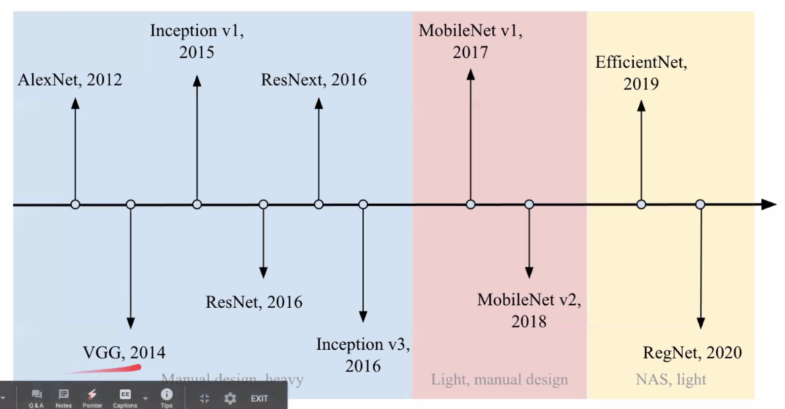
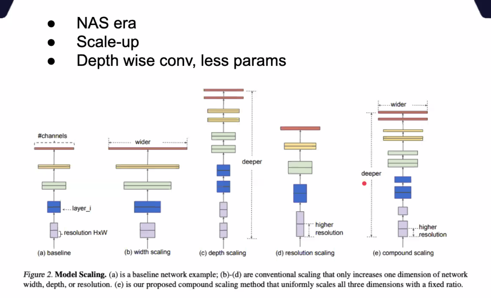
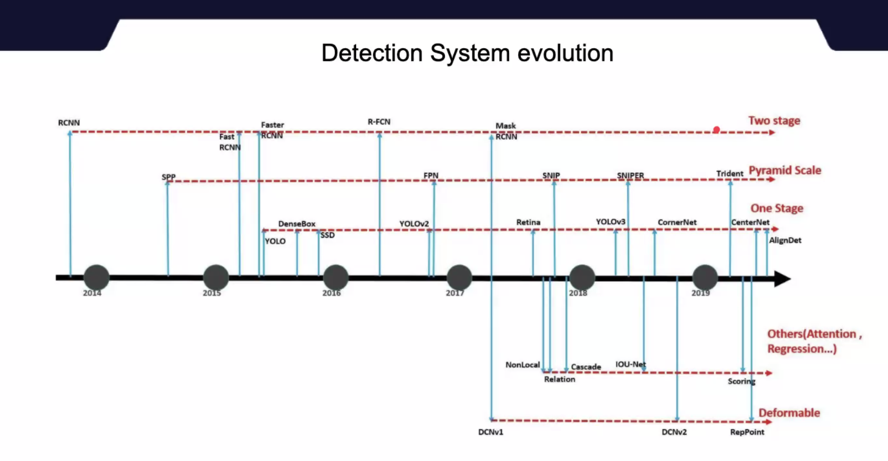

# Basic CNN architectures

| Name | Params |  |
| --- | --- | --- |
| LeNet | 60K |  |
| AlexNet | 60M | ~LeNet |
| VGG-16,19 | 140M | Uniform architecture |
| Inception v1, v2, v3, v4 | 4M | 1x1 convolutions in inception module |
| Xception |  | ~Inception. depthwise separable |
| ResNet-50,101,152 |  | Skip connections, batch normalisation |
| MobileNet v1, v2, v3 |  | For mobile phones |
| EfficientNet B1-B7 |  | Found from NAS |
| NFNets |  |  |
|  |  |  |

## **Network-in-Network (NiN)**

Introduced ‘mlpconv”, global average pooling

Global average pooling sums out the spatial information, thus it is more robust to spatial translations of the input.

## **FCN - Fully convolutional neural network**

Skip connections.

no concat unlike in U-Net

## **MobileNet**

Consists of depthwise + pointwise convolutions (depthwise separable)

Streamlined version of Xception.

2 global hyper parameters:

- width multiplier (no. of channels): thin the network uniformly at each layer (alpha X input channel)
- resolution multiplier (input image)
