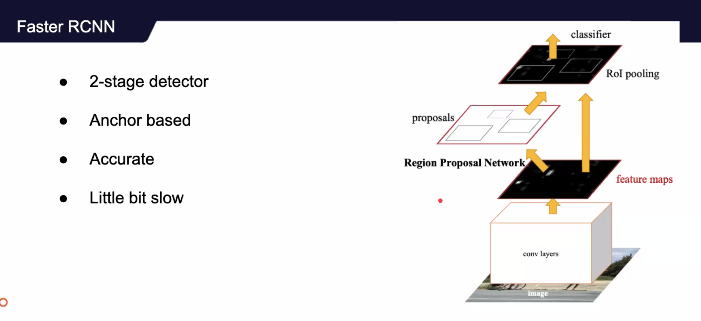
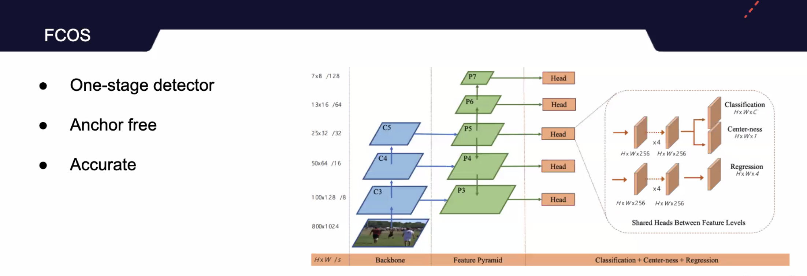
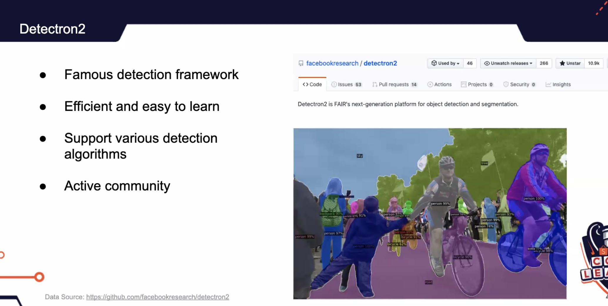

# Obj det / instance seg

- R-CNN
- Fast R-CNN
- Faster RCNN
- Mask RCNN
- Feature Pyramid Network
- SSD
- YOLO
- RetinaNet
- FCOS
- Focal loss for Dense Object Detection
- EfficientDet
- CenterNet
- DETR

| R-CNN             |           | 1                     |
| ----------------- | --------- | --------------------- |
| Fast R-CNN        |           |                       |
| Faster R-CNN      |           |                       |
| YOLO v1, v2, v3   |           |                       |
| EfficientDet-D1D7 | CVPR 2020 | EfficientNet backbone |
| SSD               |           |                       |
| RetinaNet         |           |                       |
