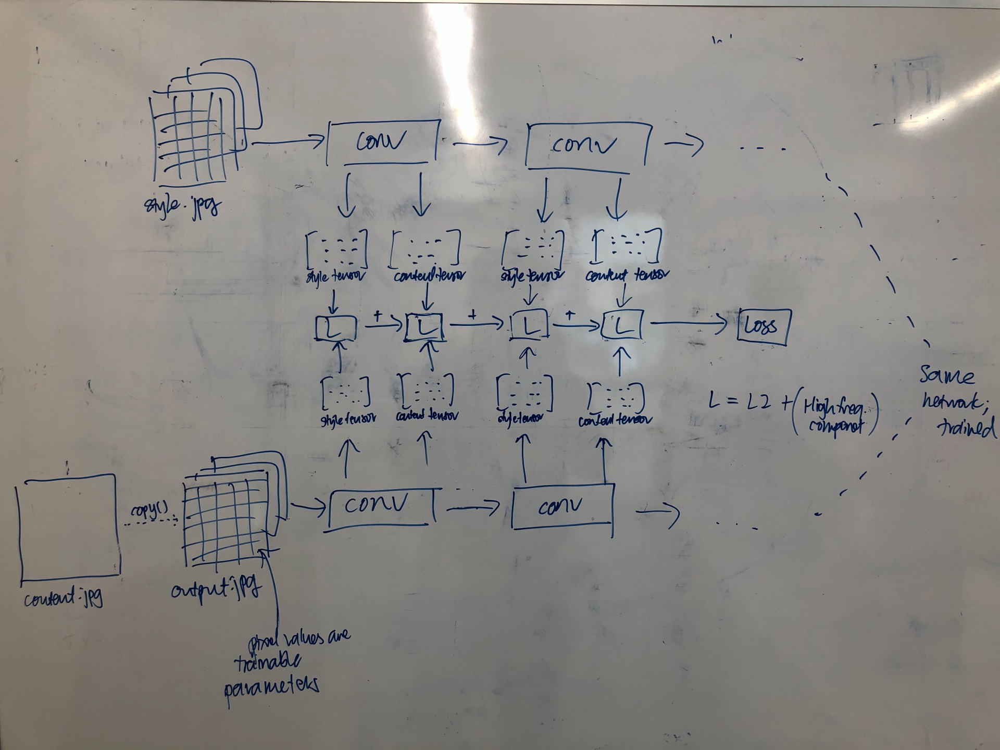

# Style transfer

- “Content image”
- “Style reference image” or “style image”
- “Output image”
- “Targets”

“High frequency component”

Use the intermediate layers of the CNN to get the content and style representations.

Calculate style = Gram matrix

Calculate content = Pixel values

Get style_targets tensors

Get content_targets tensors

# **Method 1: Naive loss**

a = MSE(output_tensor - style_tensors[0])

b = MSE(output_tensor - style_tensors[1])

c = MSE(output_tensor - content_tensors[0])

d = MSE(output_tensor - content_tensors[1])

Weighted loss = (a+b+c+d)/4

# **Method 2: With total variation loss**

Loss = naive loss + total variation loss

Total variation loss implements an explicit regularisation term on the “high frequency components of image”
