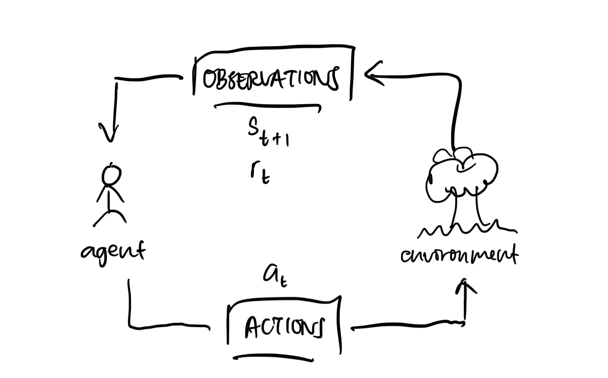

# Learning to plan in a stochastic environment

aka reinforcement learning

In the real world, we do not know the full model of the game (eg. transition rules). But one thing we have are observations. Observations are data.

Moreover, often we don't get feedback ("reward") until end of the game, hence making learning difficult. This becomes the **temporal credit assignment problem** where you need to know which move was the one that caused you to lose the game.

Goal of reinforcement learning is the agent wants to maximise its own rewards in this environment. At every step, the agent also gets a reward. The rewards is a feedback that measures the success or failure of the agent’s actions.

> 💡 So far it's an optimisation problem i.e. find the optimal policy. 
Now, we don't know the rules ("transition model") but you get them from observations. To get observations, we need to **explore**. Then, we **learn** from these explorations.

> 💡 Planners: (model → policy)
Learners: (data → policy)
where model = (states, transition rules / actions, rewards, etc.)

> 👉🏻 Experience: data

**Prediction**: fix $\pi$, learn $V$

**Control**: fix $V$, learn $\pi$

> 👉🏻 Episode: initial state to terminal state
