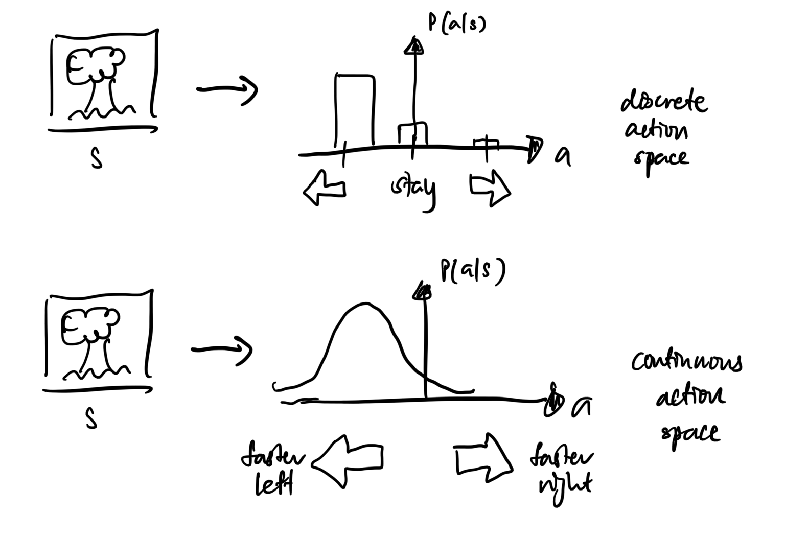

# Policy gradient

Directly optimise the policy π(s). Output the probability distribution over the space of all actions, given that state. The probability which will result in the highest Q-value. No need with the intermediate Q-function.

“Taking a left will result in a maximum Q-value of 0.9.”

To choose an action, draw a sample from this probability distribution.

Note that the advantage of using this is that one can resort to continuous action spaces.

Here’s how we can make it continuous:

If we want to take an action, sample from the policy (distribution).

