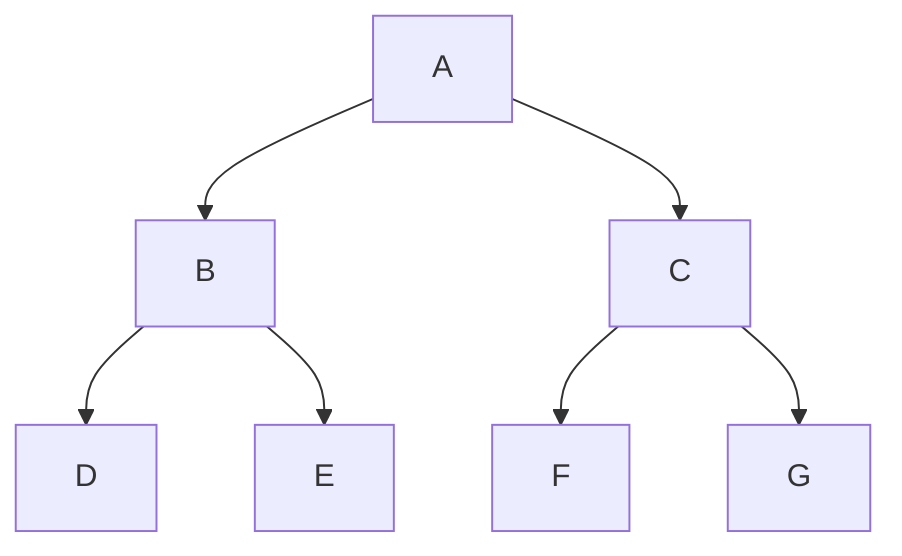
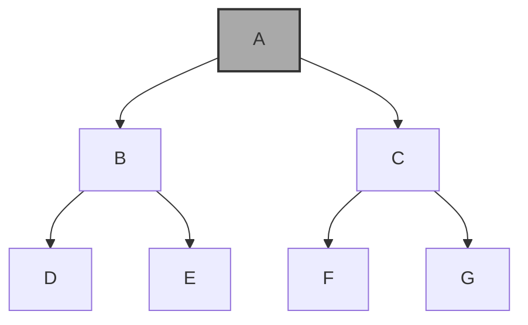
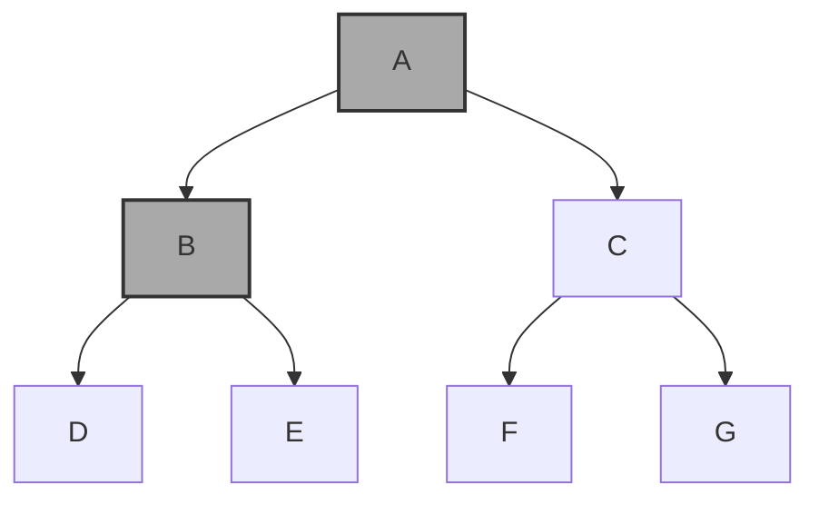
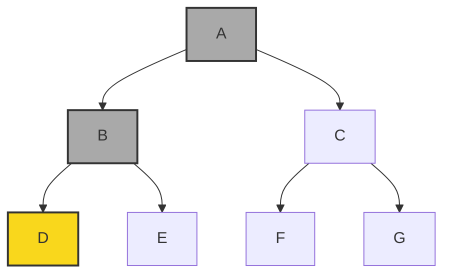
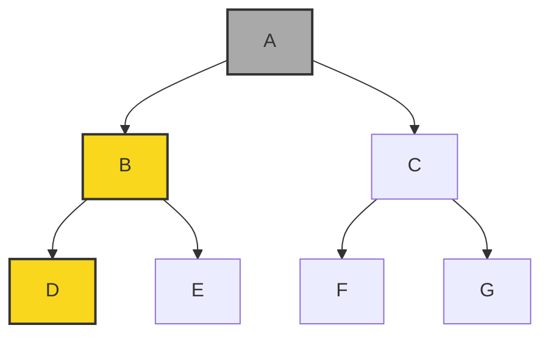
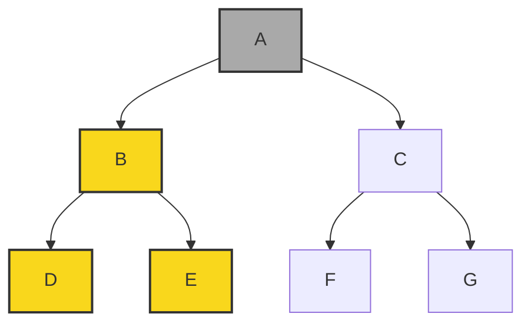

# Depth-first

Worst-case: $O(|V| + |E|)$

Used with a **stack**.

- Pre-order
- In-order (left to right)
- Post-order (bottom to top?)
Here: D, F, E, B, C, A

<button id="backButton">Back</button>
<button id="nextButton">Next</button>
