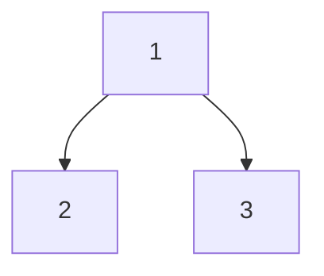
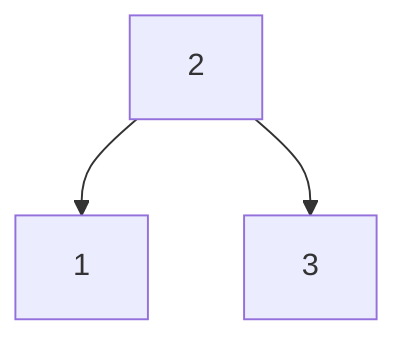

# Depth-first

Worst-case: $O(|V| + |E|)$

Used with a **stack**.

- Pre-order
- In-order
- Post-order

```mermaid
graph TD
    1 --> 2
    1 --> 3
```

```mermaid
graph TD
    2 --> 1
    2 --> 3
```

```mermaid
graph TD
    3 --> 1
    3 --> 2
```

<button id="backButton">Back</button>
<button id="nextButton">Next</button>
