# Pre-order

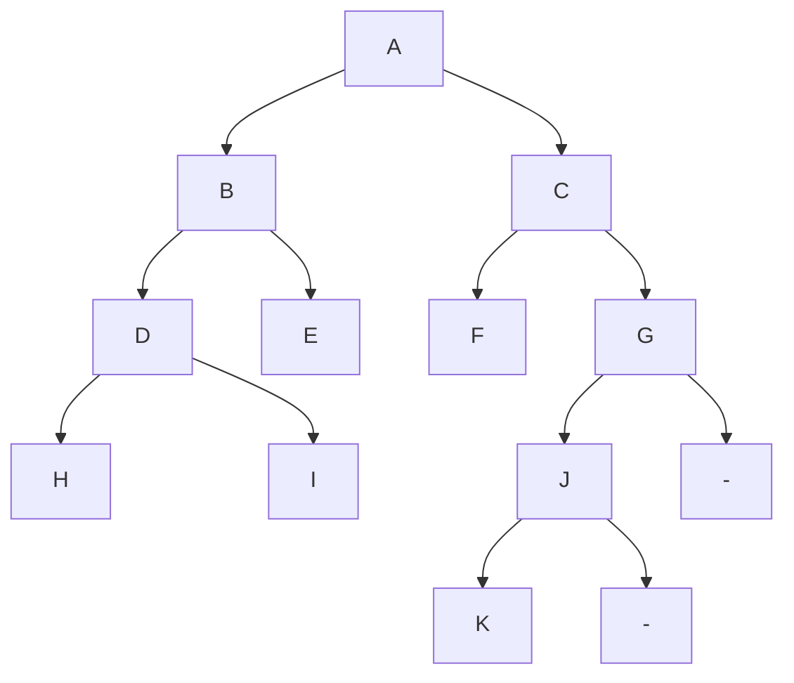
```mermaid
graph TD
    X1["-"]
    X2["-"]
    A --> B
    A --> C
    B --> D
    B --> E
    C --> F
    C --> G
    D --> H
    D --> I
    G --> J
    G --> X1
    J --> K
    J --> X2
```

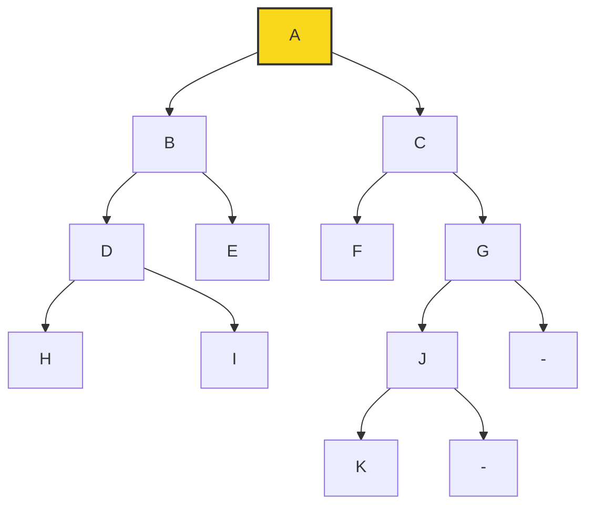
```mermaid
graph TD
    X1["-"]
    X2["-"]
    A --> B
    A --> C
    B --> D
    B --> E
    C --> F
    C --> G
    D --> H
    D --> I
    G --> J
    G --> X1
    J --> K
    J --> X2
    style A fill:#f9d71c,stroke:#333,stroke-width:2px
```

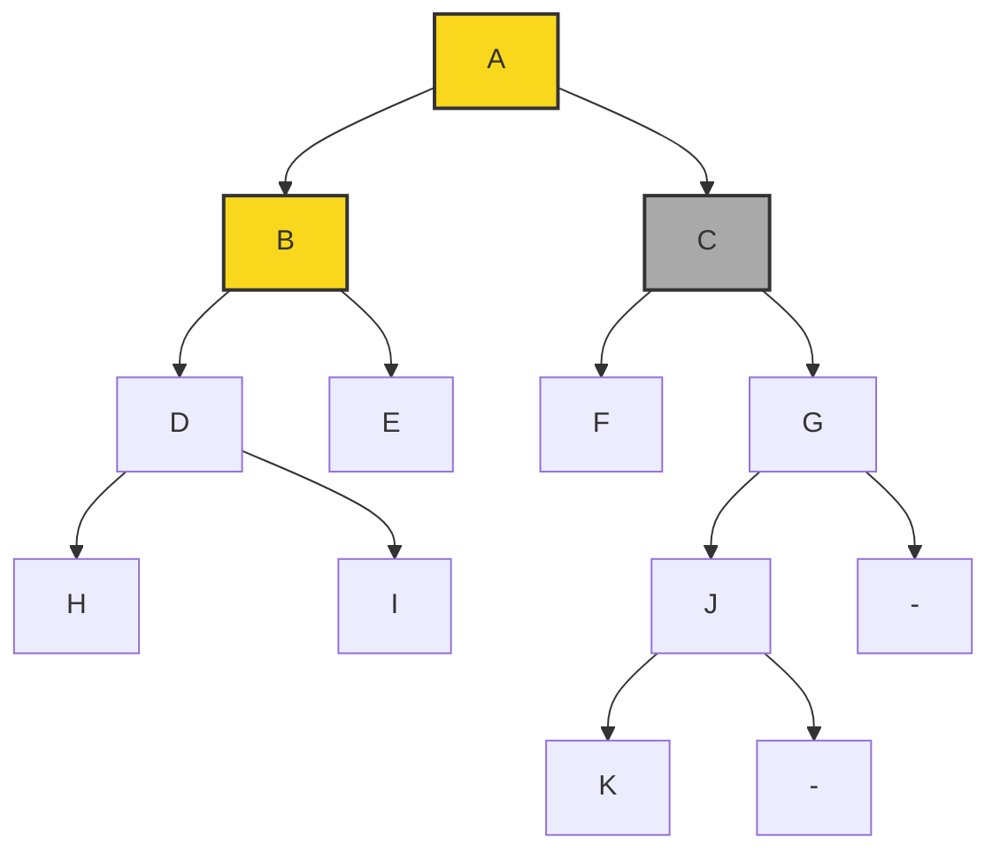
```mermaid
graph TD
    X1["-"]
    X2["-"]
    A --> B
    A --> C
    B --> D
    B --> E
    C --> F
    C --> G
    D --> H
    D --> I
    G --> J
    G --> X1
    J --> K
    J --> X2
    style A fill:#f9d71c,stroke:#333,stroke-width:2px
    style B fill:#f9d71c,stroke:#333,stroke-width:2px
    style C fill:#a9a9a9,stroke:#333,stroke-width:2px
```

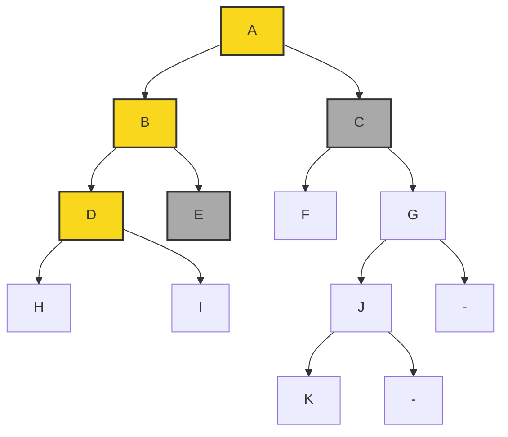
```mermaid
graph TD
    X1["-"]
    X2["-"]
    A --> B
    A --> C
    B --> D
    B --> E
    C --> F
    C --> G
    D --> H
    D --> I
    G --> J
    G --> X1
    J --> K
    J --> X2
    style A fill:#f9d71c,stroke:#333,stroke-width:2px
    style B fill:#f9d71c,stroke:#333,stroke-width:2px
    style C fill:#a9a9a9,stroke:#333,stroke-width:2px
    style D fill:#f9d71c,stroke:#333,stroke-width:2px
    style E fill:#a9a9a9,stroke:#333,stroke-width:2px
```

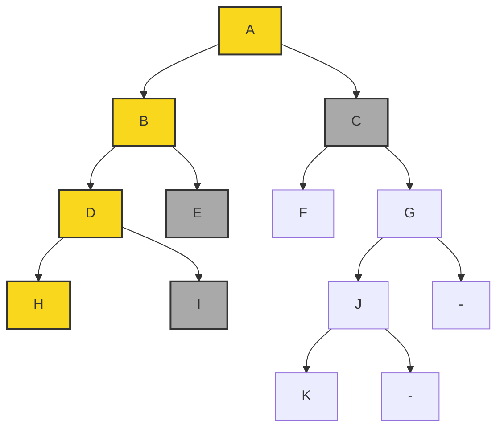
```mermaid
graph TD
    X1["-"]
    X2["-"]
    A --> B
    A --> C
    B --> D
    B --> E
    C --> F
    C --> G
    D --> H
    D --> I
    G --> J
    G --> X1
    J --> K
    J --> X2
    style A fill:#f9d71c,stroke:#333,stroke-width:2px
    style B fill:#f9d71c,stroke:#333,stroke-width:2px
    style C fill:#a9a9a9,stroke:#333,stroke-width:2px
    style D fill:#f9d71c,stroke:#333,stroke-width:2px
    style E fill:#a9a9a9,stroke:#333,stroke-width:2px
    style H fill:#f9d71c,stroke:#333,stroke-width:2px
    style I fill:#a9a9a9,stroke:#333,stroke-width:2px
```

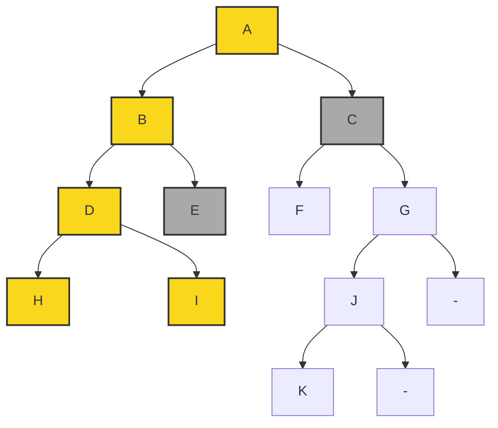
```mermaid
graph TD
    X1["-"]
    X2["-"]
    A --> B
    A --> C
    B --> D
    B --> E
    C --> F
    C --> G
    D --> H
    D --> I
    G --> J
    G --> X1
    J --> K
    J --> X2
    style A fill:#f9d71c,stroke:#333,stroke-width:2px
    style B fill:#f9d71c,stroke:#333,stroke-width:2px
    style C fill:#a9a9a9,stroke:#333,stroke-width:2px
    style D fill:#f9d71c,stroke:#333,stroke-width:2px
    style E fill:#a9a9a9,stroke:#333,stroke-width:2px
    style H fill:#f9d71c,stroke:#333,stroke-width:2px
    style I fill:#f9d71c,stroke:#333,stroke-width:2px
```

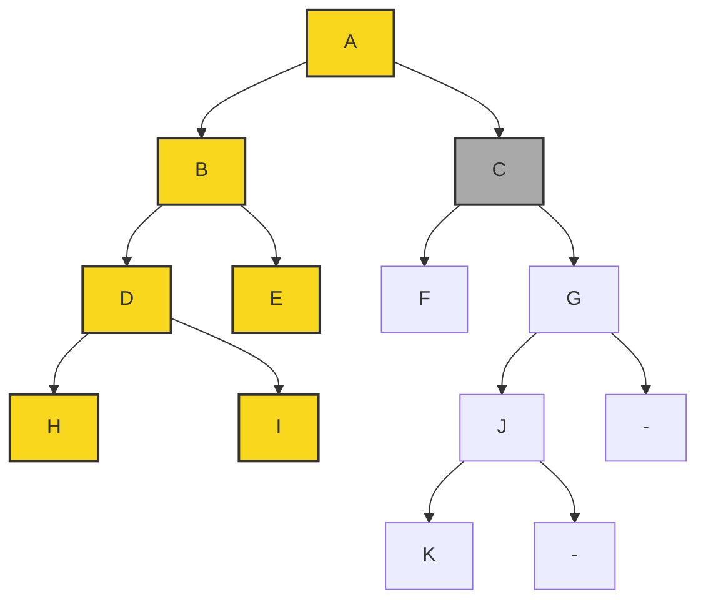
```mermaid
graph TD
    X1["-"]
    X2["-"]
    A --> B
    A --> C
    B --> D
    B --> E
    C --> F
    C --> G
    D --> H
    D --> I
    G --> J
    G --> X1
    J --> K
    J --> X2
    style A fill:#f9d71c,stroke:#333,stroke-width:2px
    style B fill:#f9d71c,stroke:#333,stroke-width:2px
    style C fill:#a9a9a9,stroke:#333,stroke-width:2px
    style D fill:#f9d71c,stroke:#333,stroke-width:2px
    style E fill:#f9d71c,stroke:#333,stroke-width:2px
    style H fill:#f9d71c,stroke:#333,stroke-width:2px
    style I fill:#f9d71c,stroke:#333,stroke-width:2px
```

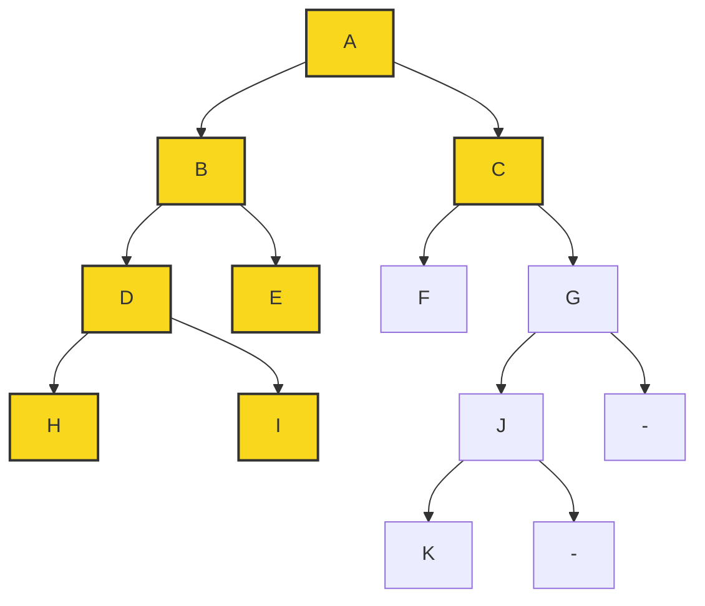
```mermaid
graph TD
    X1["-"]
    X2["-"]
    A --> B
    A --> C
    B --> D
    B --> E
    C --> F
    C --> G
    D --> H
    D --> I
    G --> J
    G --> X1
    J --> K
    J --> X2
    style A fill:#f9d71c,stroke:#333,stroke-width:2px
    style B fill:#f9d71c,stroke:#333,stroke-width:2px
    style C fill:#f9d71c,stroke:#333,stroke-width:2px
    style D fill:#f9d71c,stroke:#333,stroke-width:2px
    style E fill:#f9d71c,stroke:#333,stroke-width:2px
    style H fill:#f9d71c,stroke:#333,stroke-width:2px
    style I fill:#f9d71c,stroke:#333,stroke-width:2px
```

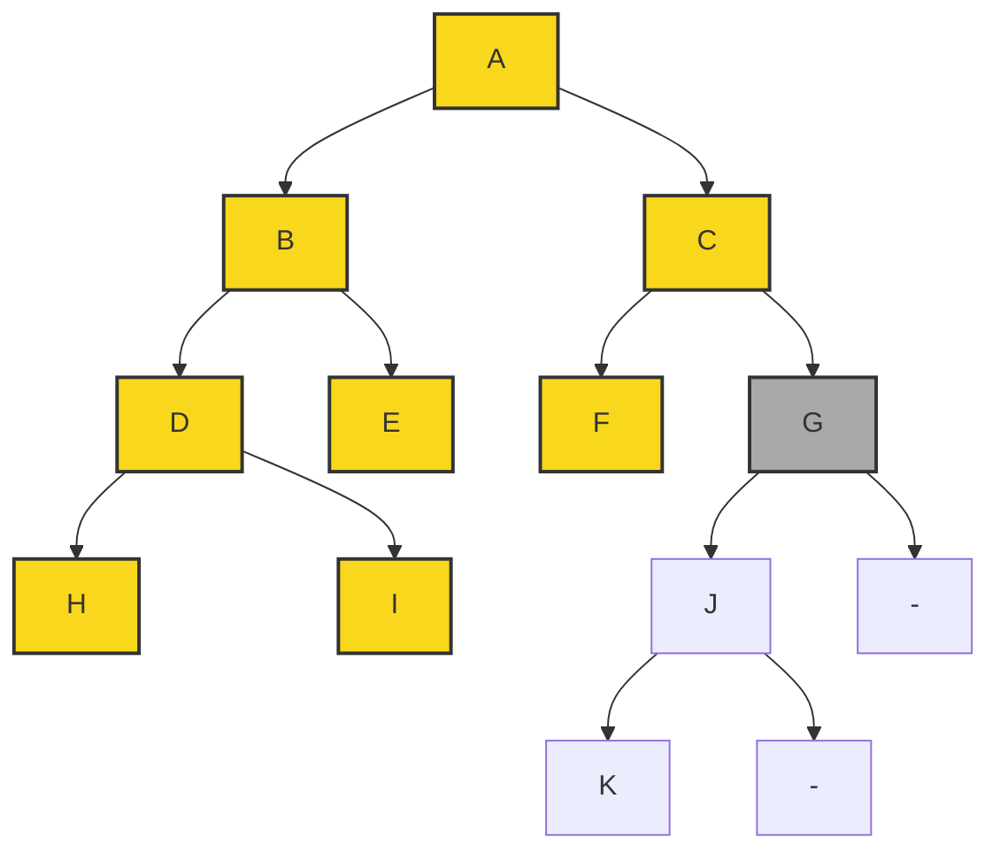
```mermaid
graph TD
    X1["-"]
    X2["-"]
    A --> B
    A --> C
    B --> D
    B --> E
    C --> F
    C --> G
    D --> H
    D --> I
    G --> J
    G --> X1
    J --> K
    J --> X2
    style A fill:#f9d71c,stroke:#333,stroke-width:2px
    style B fill:#f9d71c,stroke:#333,stroke-width:2px
    style C fill:#f9d71c,stroke:#333,stroke-width:2px
    style D fill:#f9d71c,stroke:#333,stroke-width:2px
    style E fill:#f9d71c,stroke:#333,stroke-width:2px
    style H fill:#f9d71c,stroke:#333,stroke-width:2px
    style I fill:#f9d71c,stroke:#333,stroke-width:2px
    style F fill:#f9d71c,stroke:#333,stroke-width:2px
    style G fill:#a9a9a9,stroke:#333,stroke-width:2px
```

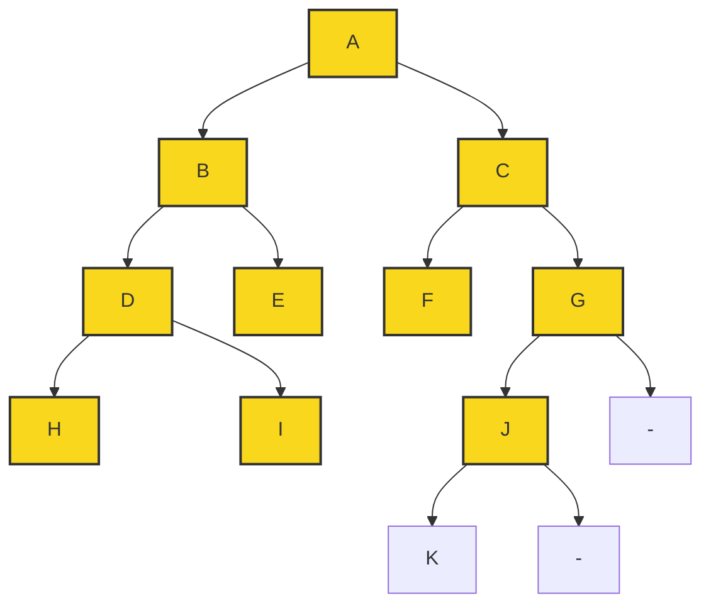
```mermaid
graph TD
    X1["-"]
    X2["-"]
    A --> B
    A --> C
    B --> D
    B --> E
    C --> F
    C --> G
    D --> H
    D --> I
    G --> J
    G --> X1
    J --> K
    J --> X2
    style A fill:#f9d71c,stroke:#333,stroke-width:2px
    style B fill:#f9d71c,stroke:#333,stroke-width:2px
    style C fill:#f9d71c,stroke:#333,stroke-width:2px
    style D fill:#f9d71c,stroke:#333,stroke-width:2px
    style E fill:#f9d71c,stroke:#333,stroke-width:2px
    style H fill:#f9d71c,stroke:#333,stroke-width:2px
    style I fill:#f9d71c,stroke:#333,stroke-width:2px
    style F fill:#f9d71c,stroke:#333,stroke-width:2px
    style G fill:#f9d71c,stroke:#333,stroke-width:2px
    style J fill:#f9d71c,stroke:#333,stroke-width:2px
```

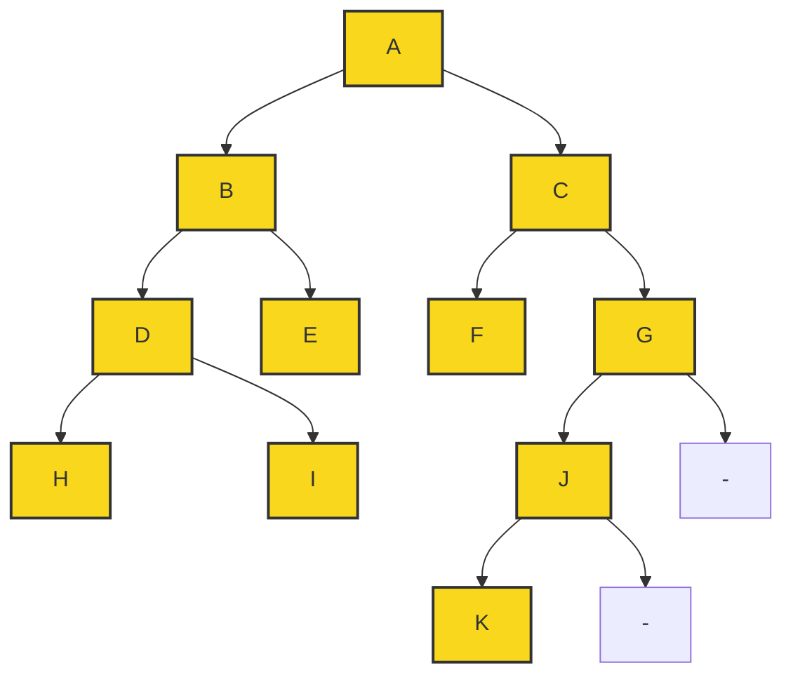
```mermaid
graph TD
    X1["-"]
    X2["-"]
    A --> B
    A --> C
    B --> D
    B --> E
    C --> F
    C --> G
    D --> H
    D --> I
    G --> J
    G --> X1
    J --> K
    J --> X2
    style A fill:#f9d71c,stroke:#333,stroke-width:2px
    style B fill:#f9d71c,stroke:#333,stroke-width:2px
    style C fill:#f9d71c,stroke:#333,stroke-width:2px
    style D fill:#f9d71c,stroke:#333,stroke-width:2px
    style E fill:#f9d71c,stroke:#333,stroke-width:2px
    style H fill:#f9d71c,stroke:#333,stroke-width:2px
    style I fill:#f9d71c,stroke:#333,stroke-width:2px
    style F fill:#f9d71c,stroke:#333,stroke-width:2px
    style G fill:#f9d71c,stroke:#333,stroke-width:2px
    style J fill:#f9d71c,stroke:#333,stroke-width:2px
    style K fill:#f9d71c,stroke:#333,stroke-width:2px
```

<button id="backButton">Back</button>
<button id="nextButton">Next</button>
