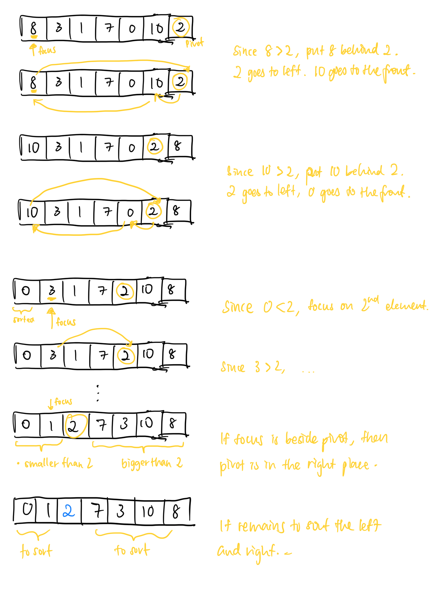

# Quick sort

- Worst case: O((n-1)) = O(n)
    
    2
    
    2
    
- Average case: O(n log n)
- Best case: Ω(n log n)
- Space: O(1), in-place
- To optimise:
    - Run both halves in parallel
    - Select median of last few elements

