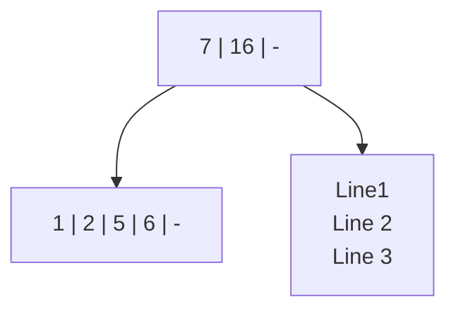

# B+ tree

```mermaid
graph TD
    P[" 7 | 16 | - "]
    C1[" 1 | 2 | 5 | 6 | - "]
    C2["Line1
    Line 2
    Line 3"]

    P --> C1
    P --> C2

```

* [BTree visualisation](https://btree.app)
* [B+ Tree visualisation](http://bplustree.app)
