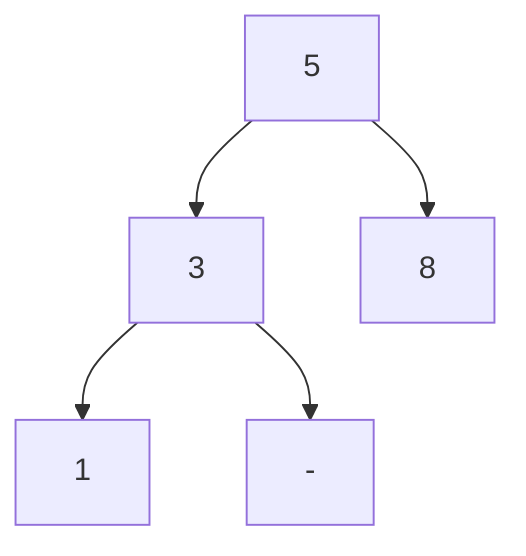

# Binary search tree

Value of left child < value of parent node 

and

value of parent node < value of right child

```mermaid
graph TD
    5 --> 3
    5 --> 8

    3 --> 1
    3 --> -
```

<button id="backButton">Back</button>
<button id="nextButton">Next</button>
