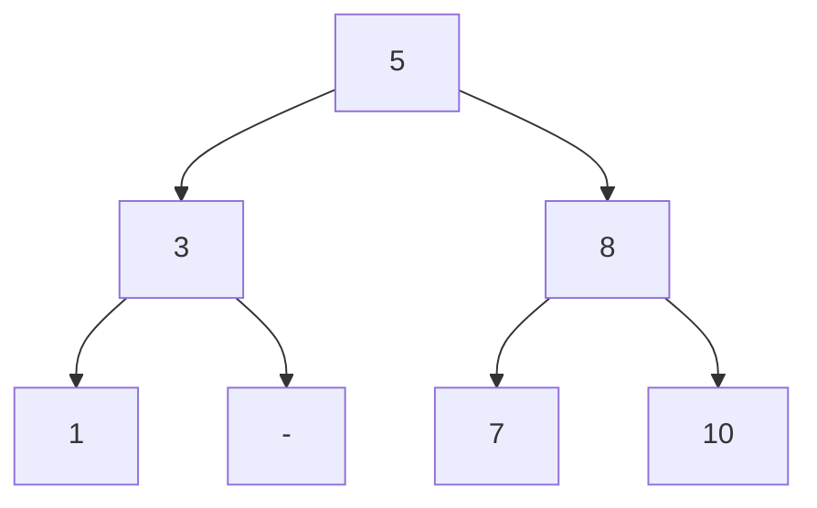

# Binary search tree

Value of left child < value of parent node 

and

value of parent node < value of right child

```mermaid
graph TD
    5 --> 3
    5 --> 8

    3 --> 1
    3 --> -

    8 --> 7
    8 --> 10
```