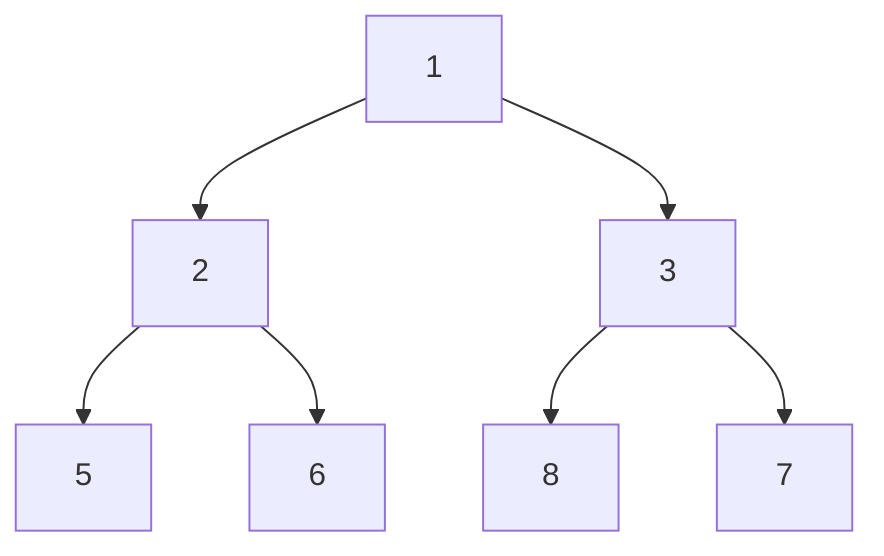

# Heap
Min heap (more common) or max heap. 

<aside>
💡 Heap property: value of parent is smaller than children

</aside>

Note: every sorted list *does* satifies the heap property.

```mermaid
graph TD;
  1-->2
  1-->3

  2-->5
  2-->6

  3-->8
  3-->7
```