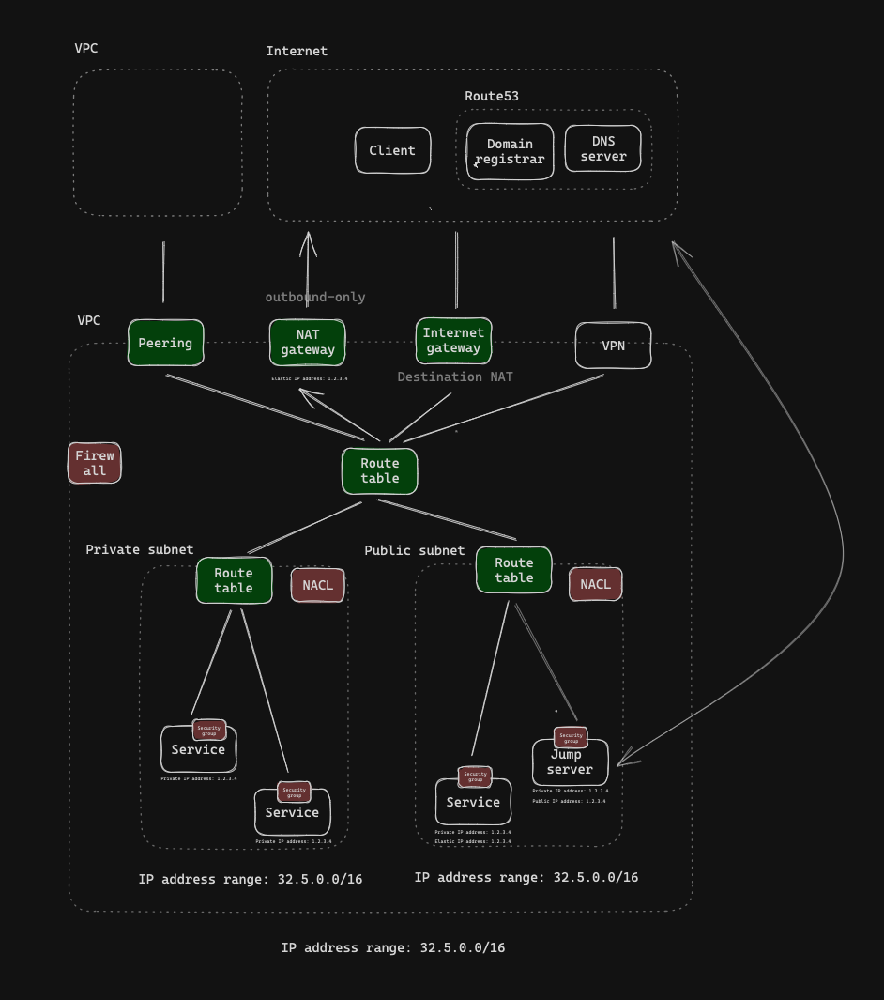

# Cloud

## Route 53

Mapping of domain name to AWS resource.

## VPC

...

## Subnet

A subnet is associated with a [VPC](#vpc).

## Internet gateway

An Internet gateway is associated with a VPC.

## NAT gateway

A NAT gateway must be associated with a public subnet. 

It is used to enable instances in a _private subnet_ to initiate IPv4 outbound traffic to internet or other services. 

it only handles the inbound responses from those outbound requests. 

## Virtual Private Gateway

## VPN as a gateway

## Route table

A **main route table** is created for a VPC by default. 

Any subnets created within this VPC can either be associated with either
* the main route table (default), or
* a **custom route table**

## VPC peering

A network connection between two VPCs.

New routes should be added to the VPC's route table to specify which traffic should traverse the peering connection.

## Network ACL

A Network ACL is associated with a subnet.

## Security group

A security group defines inbound and outbound rules.

## Instance / resource

## ENI

An Elastic Network Interface is associated with an instance. More than one ENIs can be attached to an instance. 

An ENI is automatically created for every EC2 instance.

An ENI is similar to a virtual network interface — it has attributes like private IP address etc. It also has a **security group**.

## Network Firewall

Both incoming and outgoing

## WAF (Web Application Firewall)

For incoming

## VPC endpoint
