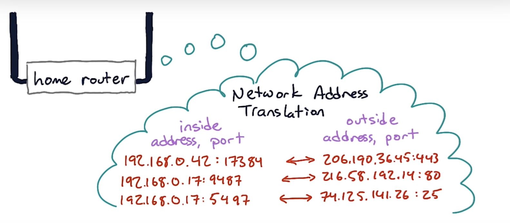
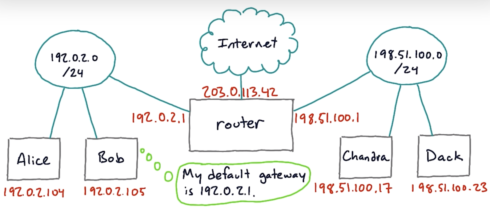
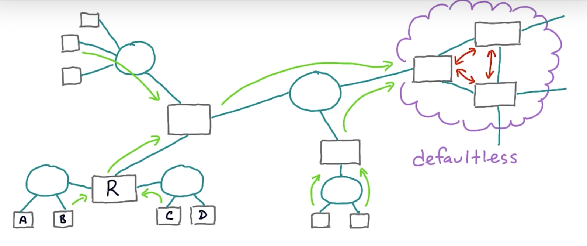

# Routing

Messages are routed via the route table.

Routing protocols

- Static: manually compute routes
- Dynamic

Every router decrements the IP packet's TTL. After decrementing, if t TTL=0, the router drops the packet and send back an ICMP "Time Exceeded" to the sender.

## NAT

Network Address Translation

A NAT allows all of the hosts of a router share one or a few public IPv4 addresses (usually between private and public). This is to deal with shortage of IPv4 addresses. What it does is to modify the IP addresses in the IP header.

Router is a device that connects two different IP networks.

