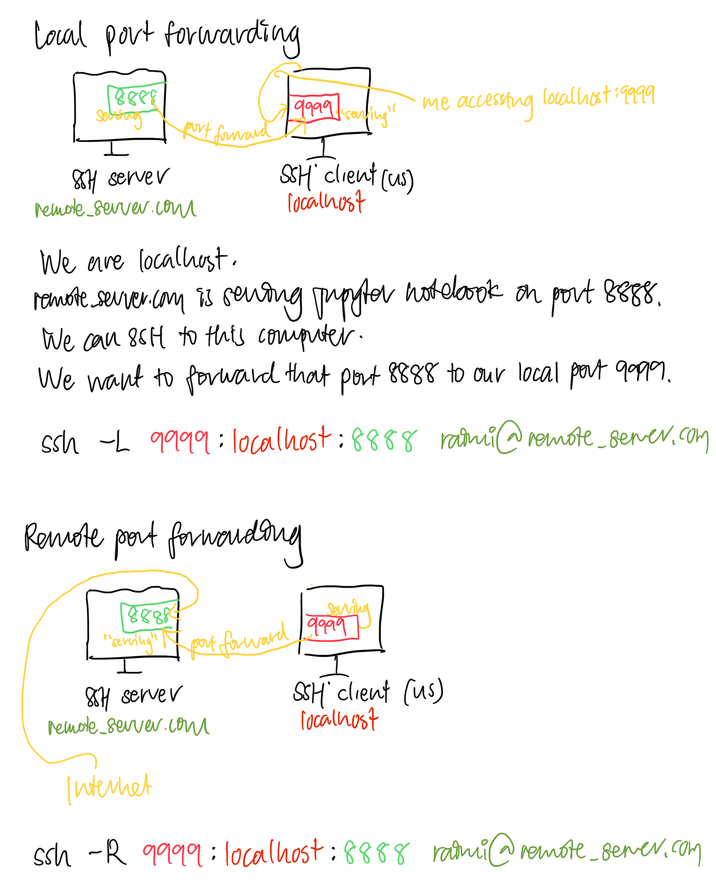

# SSH tunnel

aka SSH port forwarding

1. **Creating a tunnel**

    SSH client establishes an SSH connection with an SSH server. This is generally made over port 22.

2. **Port forwarding**

    The SSH tunnel is used to forward connections from a specified local (TCP) port to a specified remote (TCP) port (or vice versa).

    There are two types of port forwarding:
   - Local
   - Remote

   

https://robotmoon.com/ssh-tunnels/

~~~admonish example title="Use cases"
If direct access to an application is blocked by a firewall.
~~~
