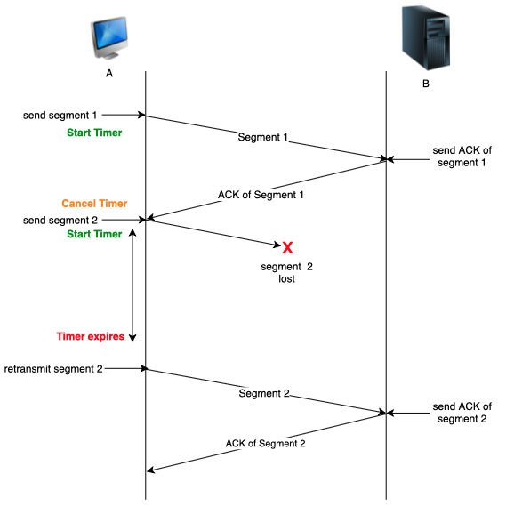

# TCP

Transport Control Protocol

TCP is a connection-oriented protocol. It is full-duplex (both hosts on a TCP connection can send messages to each other simultaneously).

~~~admonish tip title="Analogy"
* A causeway between SG and JB
* 2-way (duplex)
* k different lanes, where k is the no. of destinations (multiplexing)
* The road isnt actually concrete, vehicles can drop (network failure)
* Theres someone at both ends liaising ("reliable delivery")
    * to keep track of what hasn’t been sent
    * To slow down traffic if too congested
~~~

## Reliable delivery

| Goal                     | Solution                          |
| ------------------------ | --------------------------------- |
| In-order delivery        | Use sequence numbers              |
| No corrupted packets     | Use checksum. Discard if invalid. |
| No lost packets segments | Use retransmission timer.^        |

^TCP sends an acknowledgement for almost every segment

## Congestion control

- **Bandwidth allocation** — Bandwidth is allocated per connection. A host can open multiple connections. Bandwidth cannot be divided and allocated equally among end-systems because real traffic is transmitted in bursts and not in one continuous stream.
- **Fairness** — Increasing the transmission rate. Of one end-system necessarily decreases another.
- **Convergence** — Bandwidth should be allocated such that no one host hogs all of it.
  Congestion fixes:

Congestion fixes:

- Send packets at a slower rate in response to congestion
- Track changes in traffic
