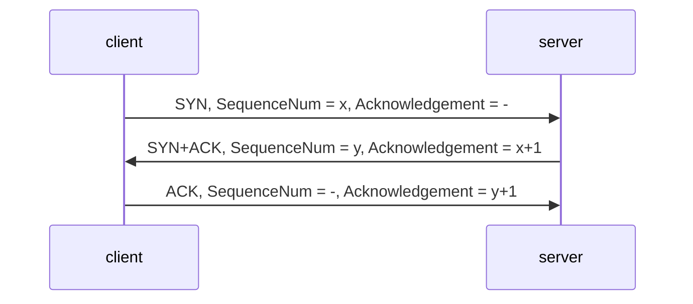

# Workflow

TCP works by a 3-way handshake:

```mermaid
sequenceDiagram
    client ->> server: SYN, SequenceNum = x, Acknowledgement = -
    server ->> client: SYN+ACK, SequenceNum = y, Acknowledgement = x+1
    client ->> server: ACK, SequenceNum = -, Acknowledgement = y+1
```
