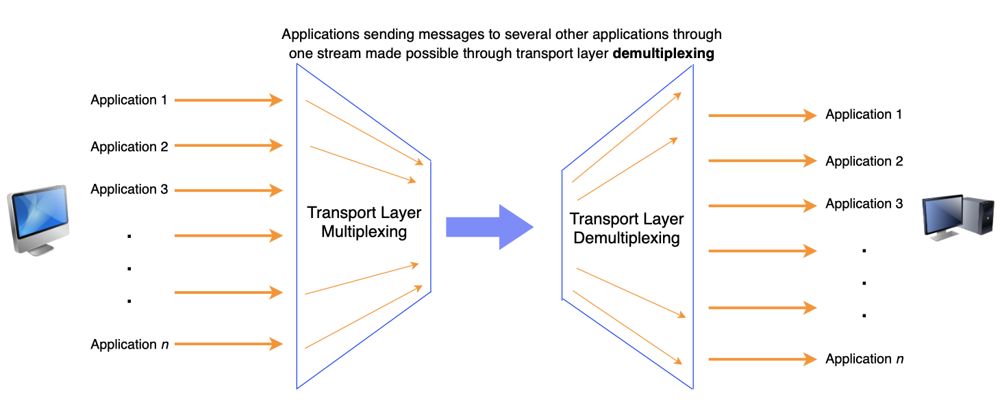

# Layer 4 - Transport

~~~admonish note
Note that the OS abstracts this layer from us.
~~~

~~~admonish tip title="Analogy"
Which "parcel delivery service".

Maybe some services require that you acknowledge that you receive and if you don't, the service will keep asking if you received.

Maybe some services require the deliverers to take a picture and make sure the parcel is still intact once it reaches the destination. 
~~~

What problems are we trying to solve?

- Network is unreliable due to **congestion** — when more packets than the network has bandwidth for are sent through, some packets get dropped ("**lost packets**") and some get delayed ("**out-of-order**").
- Not all packets go through the same route. Some packets might arrive earlier ("out-of-order").
- Packets might get altered along the way ("**corrupted data**")

```admonish info title="Definition: Bandwidth"
Rate at which the network can transport bits
```

Therefore, the goals of Layer 4 (not guaranteed by all protocols) are:

- **Packet segmentation**

- **Provide reliable delivery** of packets
  - No lost packets
  - In-order delivery
  - No corrupted data
- **Control rate of data transmission** to prevent congestion
- **Multiplexing and demultiplexing**

  To be able to handle **multiple TCP connections at the same time**, we need multiplexing.
  
  Transport layer labels packets with the port number of the application a message is from and the one it is addressed to. This allows the layer to multiplex and demultiplex the data. TCP and UDP implement these differently.

  

## Overview

|                          | QUIC              | TCP                | UDP            |
| ------------------------ | ----------------- | ------------------ | -------------- |
| Stateful connection      | Connection ID     | (IP address, port) | Connectionless |
| RTT                      | 0                 | 1                  | 0              |
| With TLS?                | ✅                | ❌                 | ❌             |
| Loss recovery mechanism  | ✅                | ✅                 | ❌             |
| Corrupted data mechanism | ✅; No retransmit | ✅; Retransmit     | ❌             |
| Data integrity check     | ✅                | ✅                 | ✅             |

```admonish info title="Definition: RTT"
Round-trip time
```
