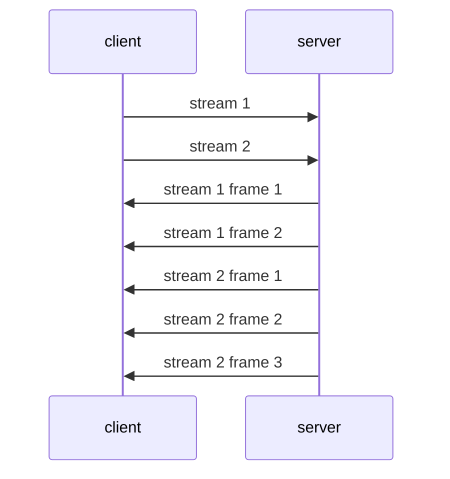
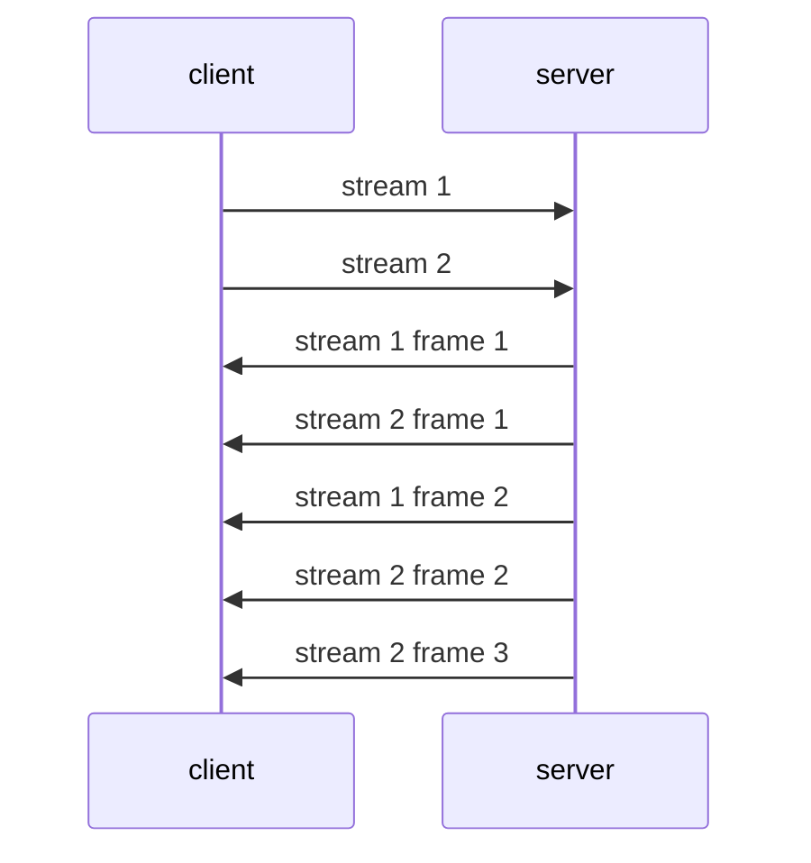

# Features

HTTP/2: [RFC 7540](https://tools.ietf.org/html/rfc7540)

| Feature                | HTTP/3 | HTTP/2 | HTTP/1.1 | HTTP/1.0 |
| ---------------------- | ------ | ------ | -------- | -------- |
| Transport protocol     | QUIC   | TCP    | TCP      | TCP      |
| Format                 | Binary | Binary | Text     | Text     |
| Multiplexing           | ✅     | ✅     | ❌       | ❌       |
| Server push            | ✅     | ✅     | ❌       | ❌       |
| Stream prioritisation  | ✅     | ✅     | ❌       | ❌       |
| Header compression     | ✅     | ✅     | ✅       | ❌       |
| Single TCP connection^ | ✅     | ✅     | ✅       | ❌       |

HTTP/2 is theoretically faster than it's predecessors.

```admonish faq title="Binary format"
In the binary protocol:
* efficient — we know exactly how much buffer to allocate (instead of read until the next delimiter) because the protocol requires the length to read; O(1) instead of O(n)
* compact — header names and values are compressed using HPACK
```

```admonish faq title="Single TCP connection"
All communication between a client and a server takes place over a _single_ TCP connection, lasting for the duration of the client's session.

This reduces the overhead of setting up and tearing down connections for each interaction.
* System call overhead
* TCP handshake
* TCP congestion control
* TLS overhead (HTTPS)
```

~~~admonish faq title="Multiplexing"
Multiplexing allows the client to fire off multiple requests at once on the same connection and receive the requests back in any order.


https://freecontent.manning.com/animation-http-1-1-vs-http-2-vs-http-2-with-push/

In HTTP/1.1, requests are processed sequentially.

Clients need to wait for the server's response to send another request.

Without multiplexing (responds to stream 1 fully (all frames), then stream 2 (all frames)):



With multiplexing, the server can _interleave_ ("multiplex") the frames between different streams.


~~~
