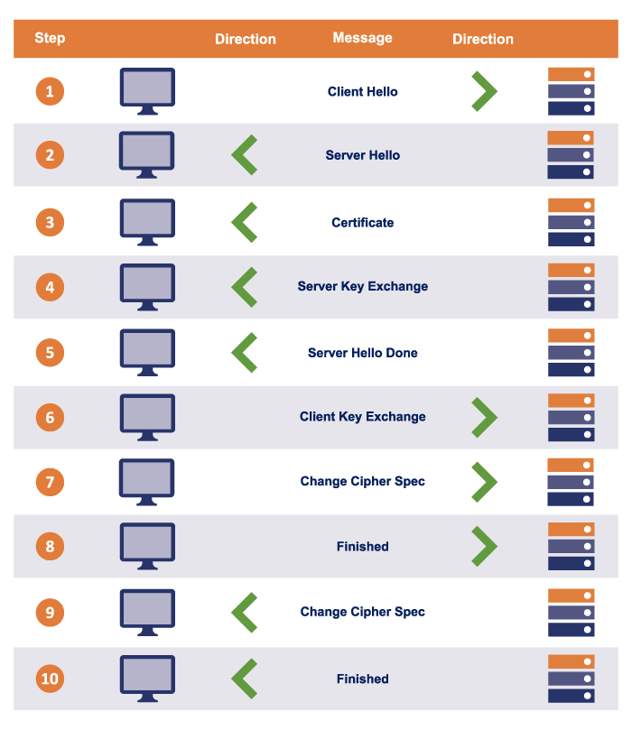

# HTTPS

HTTP + TLS




1. Browser visits an https website
2. Server replies
3. Server sends back a cert
4. Server key exchange, server gives client public key
5. -
Browser then verifies:
    1. Checks if hostname in cert is same as URL
    2. Checks if CA is valid
    3. Checks if cert is expired
1. Browser and server creating a **symmetric key** ("session key") that can be used for encrypting future data.
2. -
3. -
4. -
5.  Browser and server created a **symmetric key** ("session key") that can be used for encrypting future data.

~~~admonish tip title="See a server's SSL cert"
```
openssl s_client -connect jvns.ca:443 -servername jvns.ca
```
~~~

## Resources:

* [https://decoder.link/sslchecker/](https://decoder.link/sslchecker/)

* [https://www.cloudflare.com/learning/ssl/how-does-ssl-work/](https://www.cloudflare.com/learning/ssl/how-does-ssl-work/)

* [https://www.thesslstore.com/blog/how-does-https-work/](https://www.thesslstore.com/blog/how-does-https-work/)

* [https://www.ssllabs.com/ssltest/analyze.html](https://www.ssllabs.com/ssltest/analyze.html)

* [https://hstspreload.org/](https://hstspreload.org/)

* [https://stackoverflow.com/a/67197597/4570466](https://stackoverflow.com/a/67197597/4570466)

* [https://howhttps.works](https://howhttps.works/)
