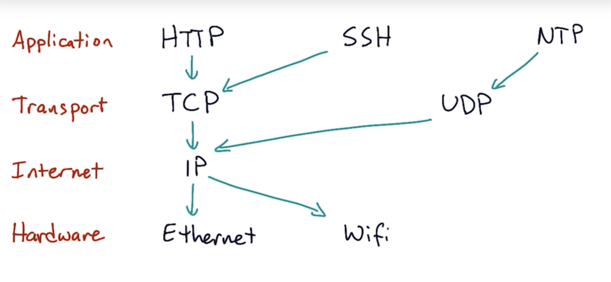
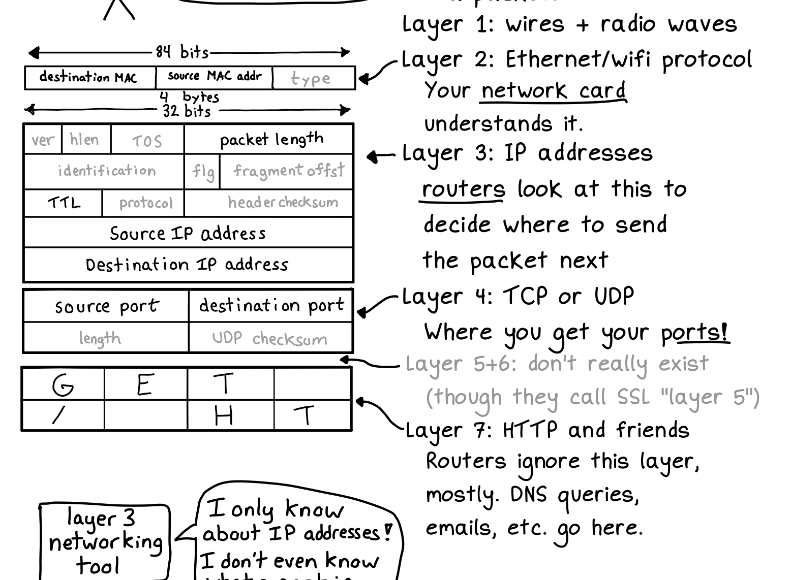

# OSI model

OSI model vs. TCP/IP model

| TCP/IP layer | OSI layers | Data | Concepts | Protocols | Where |
| --- | --- | --- | --- | --- | -- |
| Layer 4  Application | 5,6,7 | User data like email, webpage |  | HTTP, SSH, WebSocket, DNS, TLS, Telnet, DHCP, IMAP, POP, SMTP, BGP |
| Layer 3  Transport | 4 | Source & dest port, ACK Checksum—(above) | Ensure successful and reliable delivery. Requires syncing up with recipient. Segments the data. Ports. Sessions. Stream sockets. | TCP, UDP | OS kernel, system libraries |
| Layer 2  Internet | 3 | Source & dest IP addr—(above) | Routing, addressing, subnetting, packets | IP, ICMP | OS kernel, routers |
| Layer 1  Network access/link | 1,2 |  | Handles physical infrastructure and conversion digital data to signals. | Ethernet, Wi-Fi, MAC | Device drivers |
