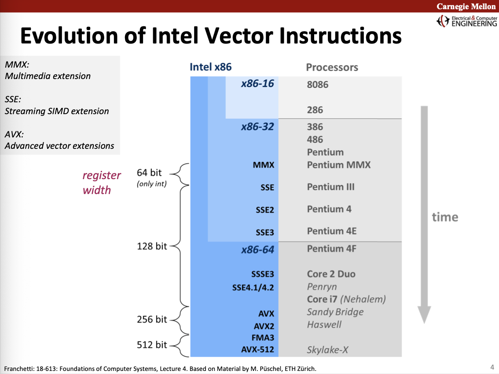

# SIMD instructions

[https://software.intel.com/sites/landingpage/IntrinsicsGuide/](https://software.intel.com/sites/landingpage/IntrinsicsGuide/#techs=AVX2&text=vpadd)

Intel vector instruction sets

Data types

_mm<output-`data-type`>_<`op`><`suffix`>_<`prefix`><`data-type`>

https://software.intel.com/content/www/us/en/develop/documentation/cpp-compiler-developer-guide-and-reference/top/compiler-reference/intrinsics/naming-and-usage-syntax.html

`<suffix>`

- -
- u (unaligned)
- 1 (?)
- zero (clear)
- r (reversed)
- l (memory)

`<prefix>`

- p (packed i.e. vector)
- s (scalar)

`data-type`

- __m128
- __m256
- __m512
- __m128d
- __m256d
- __m512d
- __m128i
- __m256i
- __m512i

__m128 = a register that can take 4 floats (32)

__m128d = a register that can take 2 doubles (64)

__m128i = a register that can take 4 ints (32)

__m256 = a register that can take 8 floats (32)

__m256d = a register that can take 4 doubles (64)

__m256i = a register that can take 8 ints (32)

__m512 = a register that can take 16 floats (32)

__m512d = a register that can take 8 doubles (64)

__m512i = a register that can take 16 ints (32)
