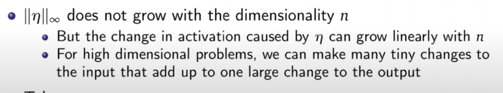

# CS5260 — Neural Networks and Deep Learning II

---

# Adversarial ML

[https://www.tensorflow.org/tutorials/generative/adversarial_fgsm](https://www.tensorflow.org/tutorials/generative/adversarial_fgsm)

## Intro

a machine learning technique that attempts to fool models by supplying deceptive input

adversarial example = image + noise

- Self-driving cars: kill people
- Spam classifiers
- Biometric recognition — steal money eg. apple pay

Given

$\tilde{x} = x + \eta$

where $\tilde{x}$ is the adversarial sample, $x$ is the image and $\eta$ is the perturbation,

then if

$$\eta_i < \epsilon$$

$$||\eta||_\infty < \epsilon$$

where $\eta$ is the number small enough to be discarded by the hardware, 

we expect the model assigns the same class to both $x$ and $\tilde{x}$.

This also makes use of the fact that digital images often use 8 bits per pixel:

(0, 1/255, 2/255, ..., 255/255)

- Take-away
    - A simple linear model can have adversarial examples if its input has sufficient dimensionality

## How to attack

### FGSM (whitebox)

Fast Gradient Sign Method

attacker has complete access to the model (white box attack)

### One-step target class method (whitebox)

### Build a substitute model

> Black-box Attack, Papernot et al. AsiaCCS 2017
> 

based on a small no. of initial queries to the model in production

## How to defend

### Adversarial training

> 💡 Metric: “89.4% error rate on adversarial examples” — which is bad

Note that adversarial training can have a negative impact (lower accuracy on clean samples, compared to models that don;’t go through adversarial training)

Must do fine-tuning together with adversarial training

Recap: Batch normalisation

Use **Disentangled Learning** via an Auxiliary BN. Uses the **AdvProp** algorithm

Motivation for this is that the 2 different samples have different distributions