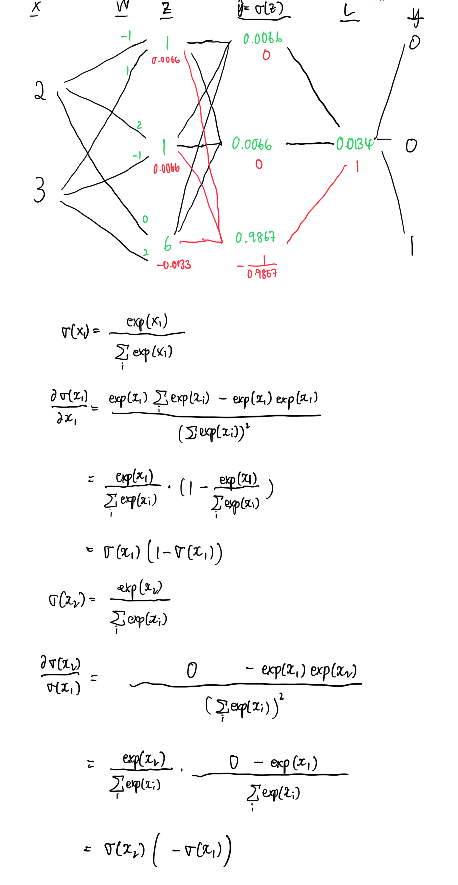

# Backpropagation softmax and categorical cross entropy

```python
import torch.nn.functional as F
import torch.nn as nn

y = torch.tensor([[0,0,1]], dtype=torch.float32)

x = torch.tensor([[2,3]], dtype=torch.float32)

y_true = torch.tensor([2], dtype=torch.long)

linear = nn.Linear(2,3,bias=False)

linear.weight.data = torch.tensor([[-1,1],[2,-1],[0,2]], dtype=torch.float32)

z = linear(x)

y_pred = F.softmax(z, dim=1)

#loss = F.nll_loss(y_pred, y_true)
loss = -torch.log(y_pred[y==1])

z.retain_grad()
loss.retain_grad()
y_pred.retain_grad()
loss.backward()
```

