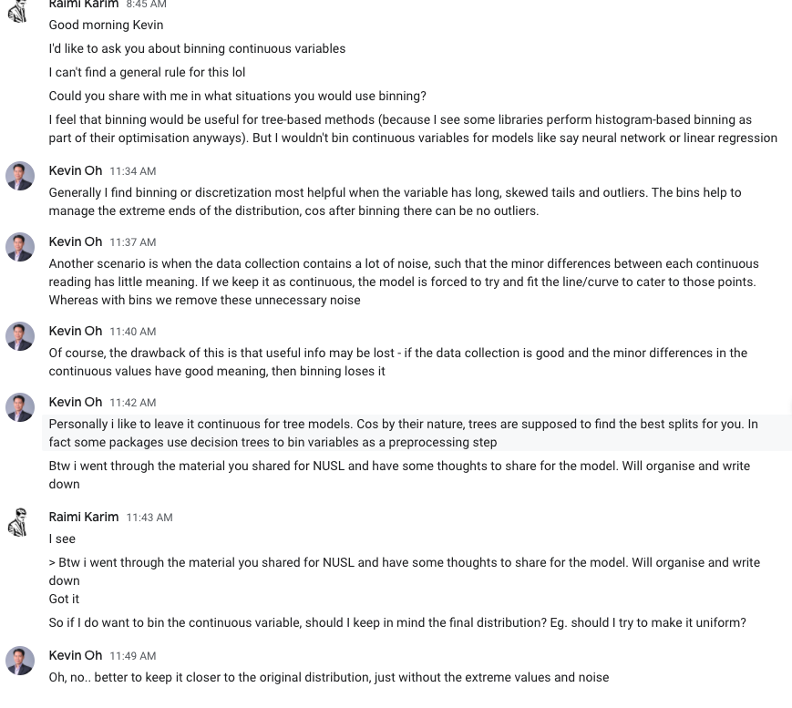
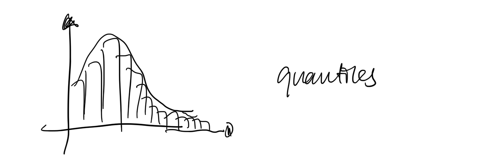

# Feature transformation

<!-- toc -->

---

## Why transform?

For scaling:

- The goal of applying feature scaling is to make sure features are on almost the same scale so that each feature is equally important and make it easier to process by most ML algorithms.
- Scaling used used for neural networks and distance-based algorithms (eg. k-NN, SVM, NN). If an algorithm is not distance-based, feature scaling is unimportant (eg. Naive Bayes, LDA, tree-based models).

## **Type transformation**

### **Categorical features**

- Ordinal
- Nominal
    - Drop
- Label encoding: for ordinal variable (with clear ordering)
- Binary encoding
- One-hot encoding: for nominal variables (without intrinsic ranking)
    
    > 💡 If cardinality is $n$, resulting encoding does have to be *n* new features. It could be $n-1$, where the last cardinality encodes for absence.
    
- One to many
- Interaction features (combine)
- Categorical data: variable that can take a limited no. of values
- High cardinality = index
- Embedding

Note on OOV (out-of-vocabulary) bucket: Having an “Others” group will ensure that the categorical transformation is robust to unseen data.

> 💡 One-hot encoding categorical features is bad for tree-based models, especially because we create many binary sparse features and from the splitting algorithm’s point of view, they’re all independent. As a result, continuous variables are automatically given higher importance and chosen at the top of the tree to make a split. [https://towardsdatascience.com/step-by-step-guide-to-explaining-your-ml-project-during-a-data-science-interview-81dfaaa408bf](https://towardsdatascience.com/step-by-step-guide-to-explaining-your-ml-project-during-a-data-science-interview-81dfaaa408bf)


### **Date time features**

Inherently cyclic features. Can be treated as embeddings. Example to convert day (1-7) to 2 feature cols:

```python
day_sin = np.sin((2*np.pi*col)/max(col))
day_cos = np.cos((2*np.pi*col)/max(col))
```

## **Numerical transformation**

### Min-max s**caling**

Max-Min Normalisation typically allows us to transform the data with varying scales so that no specific dimension will dominate the statistics, and it does not require making a very strong assumption about the distribution of the data

**How?**

$$
x' = \frac{x-x_{\min}}{x_{\max}-x_{\min}}
$$

**Why?**

So that we work with small numbers. The benefits are:

- Helps gradient descent converge more quickly.
- Helps avoid the NaN trap. Certain optimisers might result in NaNs is gradient update is too large.
- Helps the model learn appropriate weights for each feature. WIthout it, the model will pay too much attention to features having a wider range.
- Certain functions are not stable when dealing with large numbers e.g. softmax

**When?**

1. When feature is approximately uniform
2. You know the approximate upper and lower bounds
3. Few outliers

**Examples**

Age

**Counter examples**

Income

### Standardisation

aka Z-score normalisation, standard scaling

$$
z = \frac{x-\bar{x}}{S}
$$

where $x$ is the mean of the sample, and $S$ is the standard deviation of the sample.
    
Standardization centers the features at mean 0 with a standard deviation 1.

Which is preferred by many algorithms.

Standardization keeps useful information from outliers.

```admonish note
Standardisation may be used when data follows Gaussian Distribution.
```

**When?**

1. When the feature distribution does not contain extreme outliers

### **Log scaling**

$$
x' = \log(x)
$$

Note that for small $x$ (such that $1+x \approx 1$), using `np.log(1+x)` means performing `np.log(1)` which is 0. Using a slightly different transformation below, using `np.log1p` is more accurate in floating-point accuracy.

$$
x' = \log(1+x)
$$

**When?**

1. When data follows power law distribution

**Examples**

Ratings per movie

### **Feature clipping**

**How?**

1. By z-score (within 3 standard deviations)
2. Set min and max

**When?**

1. When there are extreme outliers

### **Normalisation**

Normalization scales the features to a 0-1 range.

This is a special case of Min-max scaling.

It is useful when we need the data to be in a bounded interval.

- If Gaussian
- Domain knowledge (eg. Height)

```admonish note
Normalization is great with Non-Gaussian Distribution
```

```admonish warning
Impact of Outliers is very high in Normalization
```

### **Regular binning**

Equally spaced boundaries



### **Quantile binning**

Each bin has same number of samples

**When?**

Bimodal / multimodal / uneven distribution



## Notes

