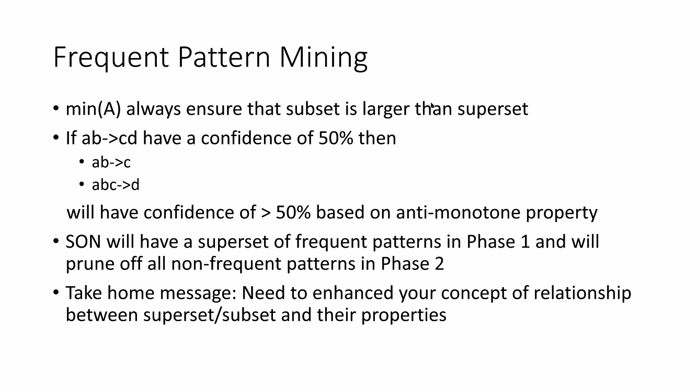

# Frequent itemsets

## Brute force

Computationally expensive. Not enough memory.

## Apriori

*k* passes

> ✅ Less expensive (use the anti-monotone property)

## PCY

(Park-Chen-Yu)

*k* passes

> ✅ Less memory

## Random sampling

no. of passes can be customised

Run an algorithm eg. Apriori. 

Note that false positives (itemset may be frequent in the sample but not in the entire set of baskets) false negatives may occur. To reduce these, we can use a smaller threshold, but requires more space.

## SON

(Savasere Omiencinski Navathe)

2 passes

Divide the baskets into chunks

Key ideas:

1. If an itemset is not frequent in any chunk, then it is indeed not frequent.
2. If an itemset is indeed frequent, then it is frequent in at least one chunk.

> ✅ Less memory (cos distributed)

