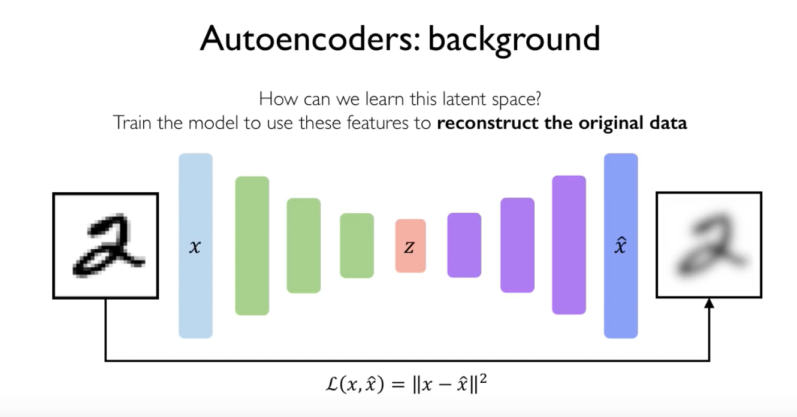

# Deep generative models

---

Supervised learning: learn function to map x to y.

Unsupervised learning: learn hidden or underlying structure of data

Generative modelling: learn a model that represents distribution of data

Main tasks:

- Density estimation
- Sample generation

# Why learn generative models?

Debiasing

Outlier detection

# Generative models

- Autoencoder
- VAE
- GAN

> 💡 **Autoencoders**
Bottleneck hidden layer foreces network to learn a compressed latent representation. Reconstruction loss forces the latent representation to capture as much information about the data as possible.

## Autoencoder

Encoder learns mapping from the data x to a low-dimensional latent space z (“compressed”).

Decoder learns mapping from latent z to a reconstructed observation, x_hat.

Loss function is L(x, x_hat). It doesn’t use any labels.

Reconstruction loss forces the latent representation to capture as much information about the data as possible.

## VAE

Variational autoencoder

Instead of learning a deterministic latent vector z, we learn a vector of mean and a vector std that parametrise the probability distribution for each of the latent variables

## GAN

Generative Adversarial Network

Instead of explicitly modelling the density (distribution of data), we just sample to generate new instances. However, we can’t sample from complex distribution directly. Thus the solution is to sample from something simple (noise), **learn a transformation** to the training distribution.

> 💡 We also cannot measure the difference of the generated samples with training samples because it's too expensive.

Adversaries (neural networks): 

- The generator turns noise into an imitation of the data
- The discriminator tries to discern between a fake generated by the generator and the true data.

# Uses

Style transfer: CycleGAN

# Mitigating bias through learned latent structure

1. Learn latent structure using VAE.
2. Estimate distribution. (How?)
3. Adaptively resample data.
4. Learn from fair data distribution.