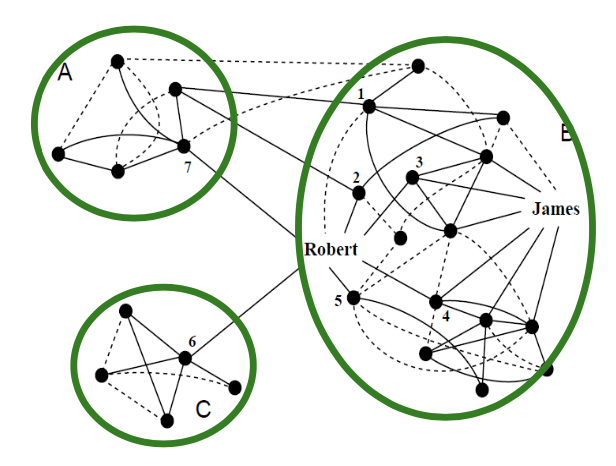

# Graph analysis

<!-- toc -->

---

## Community detection

Note that data is a tuple of $(V,E)$ (undirected?). (In usual clustering task with no edges, these graphs are called "trivial graphs")

Partition network such that

1. inter-group edges are sparse
2. intra-group edges are dense



### Hierarchical clustering

Define similarity between nodes

- no. of node disjoint paths ???
- no. of edge disjoint paths ???
- ...

$O(|V|^3)$?

Problem

### Girvan-Newman algorithm

Hierarchical divisive method. 

1. Start with whole graph
2. Find edge whose removal will partition the graph. Use edge betweenness.
3. Repeat until single nodes

Edge betweenness 

$$
B(a,b) = \frac{\text{no. of shortest paths that pass through a and b}}{\text{no. of shortest paths}}
$$

is a measure of edge importance, i.e. how important an edge is in keeping the graph connected such that if we cut this edge, it makes a lot of difference and will create more meaningful partitions. 

<aside>
💡 An inter-community edge has a higher betweenness than an intra-community edge.

</aside>

Algorithm to compute edge betweenness

Time complexity $O(|E|^2|V|)$

1. For a vertex, calculate betweenness of every edge $O(|E|)$.
2. Final score $O(|V|)$.
3. Remove the edge with the highest betweenness.
4. Repeat for the other edges. $O(|E|)$.

## Ranking

Goal is to rank the nodes in a directed graph $(V,E)$.

### PageRank

Limitations

- Dead end → Jump to a random page
    
    from
    
    ```python
    0.5 0.5 0  
    0.5   0 0
      0 0.5 0
    ```
    
    to
    
    ```python
    0.5 0.5 0.33
    0.5   0 0.33
      0 0.5 0.33
    ```
    
- Spider trap → Teleport
- Measures generic popularity of a page → **Topic-specific PageRank**
- Only 1 measure of importance → **Hubs-and-Authorities**
- Susceptible to link spam → **TrustRank**
