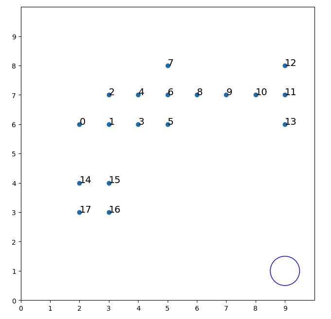
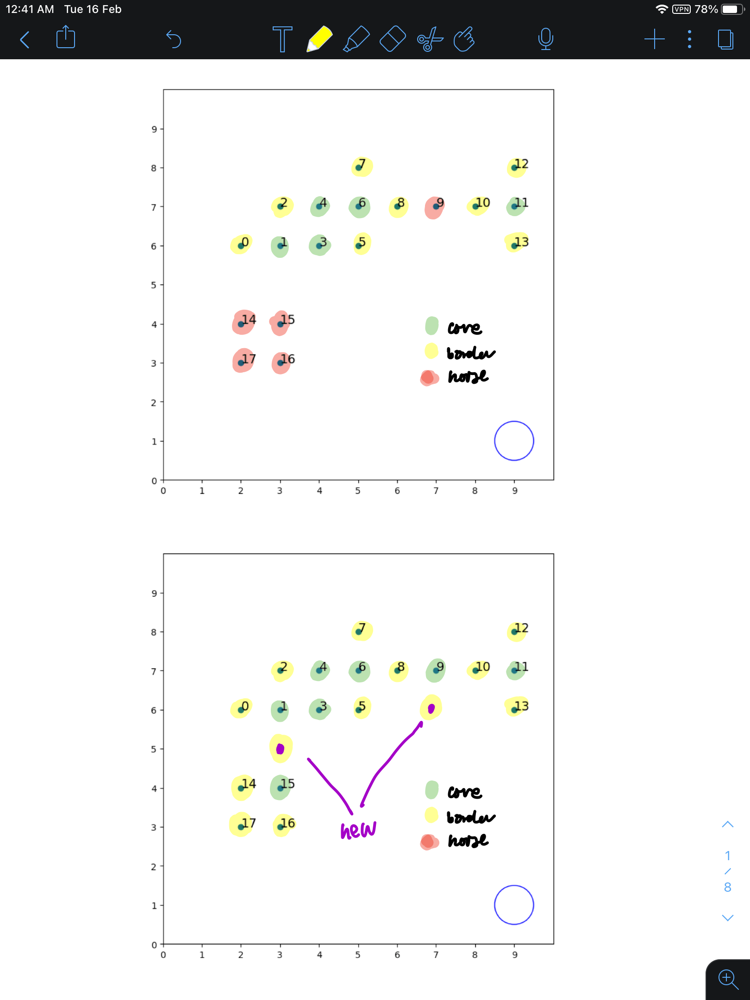
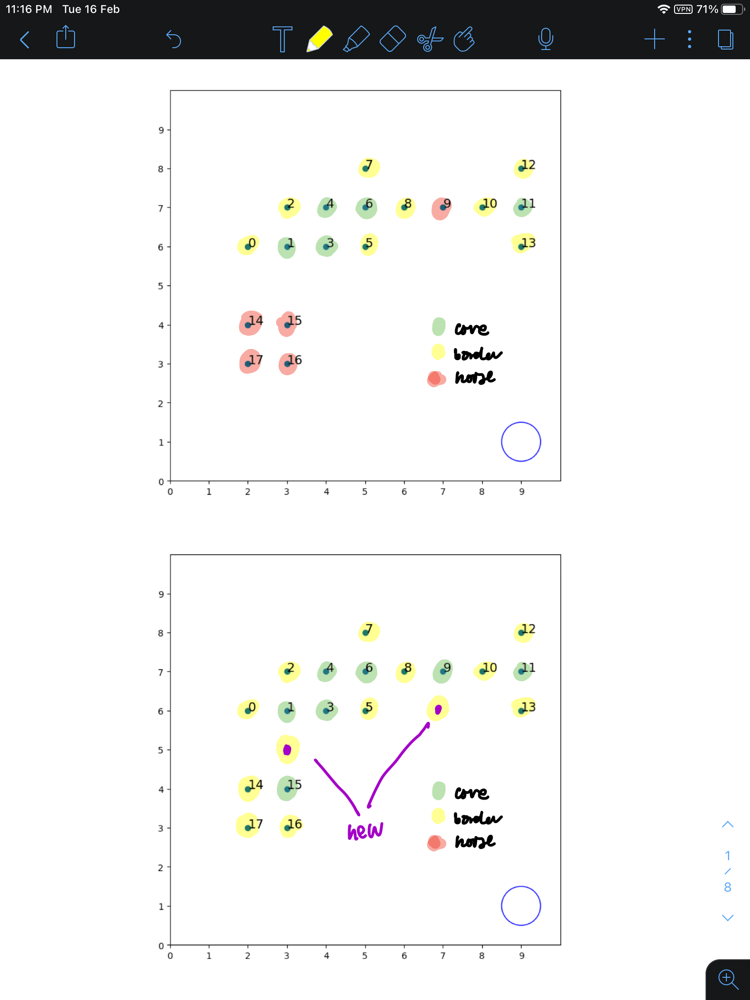
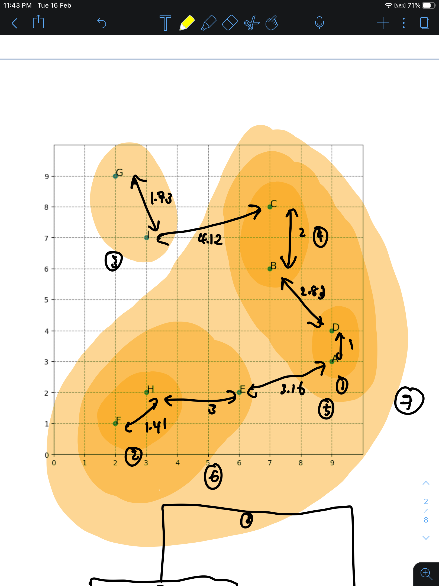
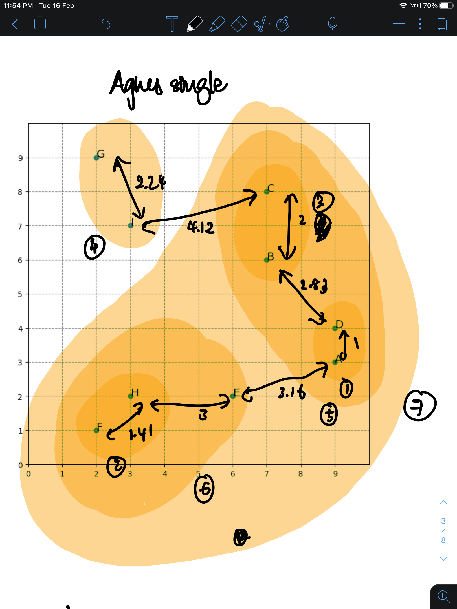

# Hierachical clustering

- agglomerative (slowly accumulate)
- divisive (slowly split)

Naive implementation has time complexity $O(n^3)$ where $n$ is the no. of datapoints

1. Find pairwise distance — $O(n^2)$
2. Merge the 2 closest points.
3. Repeat for the other $n-1$ points — $O(n)$

Can use priority queue to get $O(n^2 \log n)$.

Hierarchical clustering is achieved by use of a metric and a linkage criterion.

Examples of linkage criteria:

- Single linkage (minimum)
- Complete linkage (maximum)
- Average linkage (average between pairs)
- Ward
- Centroid

