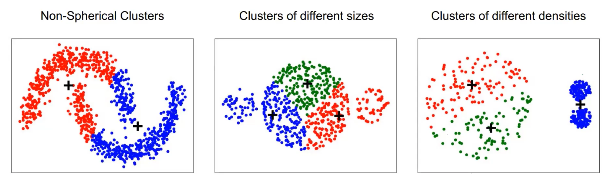
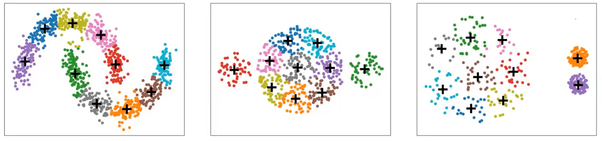
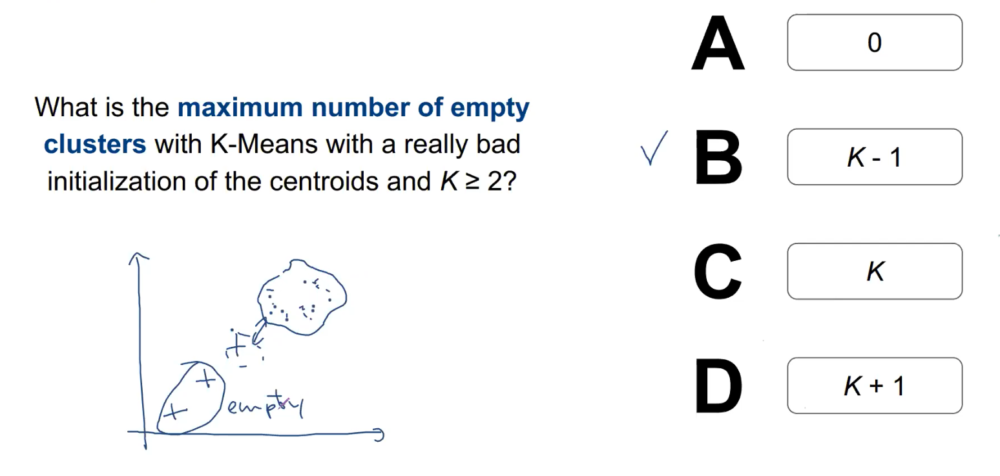

# k-means

**#nonparametric**

<!-- toc -->

---

## Before notes

1. Assign *k* centroids randomly
2. Get each data point to see which centroid it’s closest to, and assign a class
3. Calculate centre of points for each group
4. Reassign the *k* centroids
5. Use silhouette heuristic or the elbow method to determine a reasonable value for *k*


> 💡 Assumes clusters are normally distributed in each dimension

Time $O(m \cdot k \cdot n)$

1. Assign *k* centroids
2. For every datapoint, calculate distance to all other centroids — $O(k)$
3. Repeat for all datapoints — $O(n)$
4. Reassign each datapoint to the nearest cluster
5. Repeat for *m* iterations until convergence — $O(m)$

Space $O(n)$

---

## From CS5228:

Clusters: centroid-based

Clustering: partitional, exclusive, complete

NP-hard; $O(N^{Kd+1})$.

Define the objective function to minimise:

$$
SSE = \sum_{k=1}^K \sum_{x_{i,k} \in C_k} (x_{i,k} - c_k)^2 
$$

which is the total squared distance between every point and centroid across all the *K* clusters. For every cluster *k*, and for every point $x_{i,k}$ in this cluster $C_k$, find the squared distance between the point $x_{i,k}$ and the cluster's centroid, $c_k$.

Taking derivative with respect to $c_k$, the best centroid can be found as follows:

$$
\frac{\partial}{\partial c_k} SSE = 0 \\\\
\implies c_k = \frac{1}{m_k} \sum_{x_{i,k} \in C_k} x_{i,k}
$$

```admonish note
k-means works on relative distances.
```

### Lloyd's algorithm

1. Select $K$ points in the space (not datapoints) as initial centroids
2. Repeat
    1. Assign each point to the nearest cluster
    2. Reassign the centroid based on average
    

Note:

- Always converges
- But returns a local optimum

- Susceptible to natural clusters (only looks for spherical shapes). Potential workaround is to choose a larger value of $K$.
    
    
    
    
    
- Different initialisations yield different clusterings. Some centroid can yield empty clusters.
    
    
    
    *All* the points are closest to only 1 centroid.

### k-means++

Same like Lloyd's but different initialisation:

1. Initialisation
    1. Pick random datapoint as first centroid
    2. ??????????  just ensures the centroids are distributed across the dataset
2. Repeat
    
    ...
    

> 💡 Only initial centroids must be datapoints.

### X-means

1. Start with $K=2$.
2. For every cluster, see if it can be split by 2. This uses a scoring function like BIC, AIC, MDL.


### k-medoids

Use when you cannot compute averages.

????????? use Jaccard similarity ????? (prof didn't explain properly)

Implementations:
* [BanditPAM](https://github.com/motiwari/BanditPAM)

```admonish warning
Centroids must be datapoints
```

## Quiz


