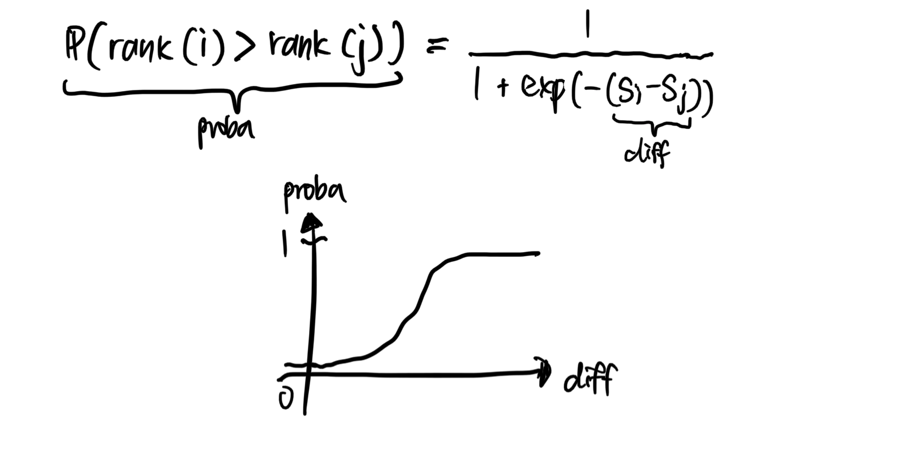
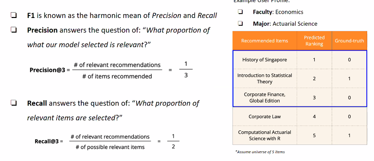

# Learning to rank

<!-- toc -->

---

Used in information retrieval and recommender systems.

## Data scope

For learning to rank, we are trying to compare between positive samples and negative samples. 

## **Objective**

Train a model to predict the probability of a certain item ranking over another (pairwise ranking). This directly trains the model to rank the items, contrary to using proxy measure (eg. probability of a user clicking on an item).

## **Difference between supervised learning and LTR**

Supervised learning: Click probability is {ItemA: 90%, ItemB: 10%}

LTR: ItemA will rank higher with probability 70%

## **Algorithm**

Inputs: 2 item embeddings

Penultimate output: Scores (the higher the score, the higher the rank)

Output: Probability of one item ranking over the other

Target: Binary

## **Score to probability**

Based on the algorithm above, we find a way to translate the score to probability. Here are our needs:

- Larger difference in scores translate to a larger probability
- If scores are equal, the probability should be 0.5
- The probability function should be symmetric

With these, the sigmoid function is a natural choice.

## Inference time

## Loss function

We want the probability to be large -> maximise probability = minimise negative probability

Because of this we use a negative log likelihood of the probability as the loss function.

$$
-\log \frac{1}{1 + \exp(-(s_i-s_j))} = \log(1 + \exp(s_i - s_j))
$$

Because of this formulation, the pairs of dataset should be in terms of (i,j) where the true ranking of I is higher than j.

Optimiser: Gradient descent

## Rank-aware evaluation metrics

- MMR (maximal margin relevance)
- CG (cumulative gain)
- DCG (discounted CG)
- IDCG (ideal DCG)
- NDCG (normalised DCG)
    
    Measure of ranking quality.
    
- MAP (only relevant documents!)
    If my mAP@10 = 0.8, it means that on average (across users), if I predict k items for you (where k can be 1≤k≤10), 0.8k will be relevant.
    [https://web.stanford.edu/class/cs276/handouts/EvaluationNew-handout-1-per.pdf](https://web.stanford.edu/class/cs276/handouts/EvaluationNew-handout-1-per.pdf)

    
    
    

    AP@5 is per user

    mAP@5 is averaged across all users

## **Variants**

- RankNet (agnostic to actual ranking, because of training the data in a pairwise manner)
- LambdaRank
- LambdaMART

## **Others**

- RankSVM
- RankBoost
