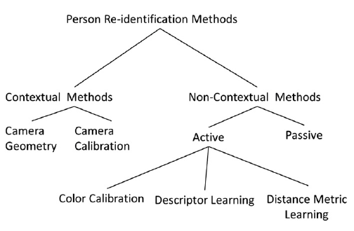

# Reidentification

Biometrics

Face recognition

Person ReID (Person Reidentification)

Deep learning

- Siamese network

Traditional

- Perceptual Image Hashing + Hamming Distance
- Keypoint matching

Feature matching

- Hamming distance
    - the no. of different individual bits
    - 0110 and 0111 = 1

# **Metric/Distance-based loss functions**

- Contrastive loss
- Contrastive loss + softmax loss
- Triplet loss
- Improved triplet loss
- Quadruplet loss
- Triplet hard loss

Alignment

- AlignDlib

# **Datasets**

**Face ReID**

Architecture

Facenet

LFW dataset (labeled faces in the wild)

FaceScrub

CASIA webface

**Person ReID**

AlignedReID

Market1501 (person reid)

CUHK

Contextual methods are where we use external information such as position, angle etc. of cameras to aid Reid

# **Hand Biometrics: Verification and Identification**

Every human hand is unique. Most of hand geometry systems/techniques is based and 2D hand images.

## **Biometric speak**

“Enrolment hand”

## **Hand biometrics processing pipeline (2D)**

1. Imaging techniques
    1. Devices
        1. Special device with pegs
        2. Special device without pegs
        3. Static image
        4. Video
    2. Modality
        1. 2D
        2. 3D
2. Preprocessing
    1. Segmentation
    2. Binary image
    3. Voronoi diagram
3. Feature extraction
    1. Hand geometry (30 global features)
    2. Palmprint
    3. Palm texture
    4. Key points (valleys, finger tips) for alignment
4. Feature matching
    1. Feature Vector
        1. Euclidean distance
        2. Absolute distance
        3. Hamming distance
        4. Normalised correlation
        5. Cosine similarity
        6. Mahalanobis distance
    2. Alignment-based
        1. Mean alignment error
        2. Goodness of alignment
        3. Others eg. hand geometry, palm texture etc.
5. Classification
    1. RBF
    2. SVM
    3. GMM
    4. Neural network classifier [1]
    5. k-NN
    6. ‘SurfaceCode’
    7. Template distances matching
