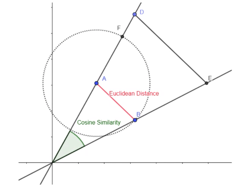

# Similarity measures

Distance metrics, distance measures

For $n$ datapoints, computing pairwise distance is $O(n^2)$ because 

$$
{n \choose {2}} = \frac{n(n-1)}{2}
$$

Axioms of distance measures:

- Non-negativity — d(a,b) ≥ 0
- Symmetry — dist(a,b) = dist(b,a)
- Identity — d(a,b) = 0 iff a=b
- Triangle equality — d(a,b) ≤ d(a,x) + d(x,b)
    
    ```python
           a *
     
                           * x
    
               b *
    ```

## Manhattan distance

(shortest path by along a grid) L1 norm

$$
|A-B|
$$

or

$$
\sum_i |a_i-b_i|
$$

## Euclidean distance

(shortest path) L2 norm

$$
||A-B||_2
$$

or

$$
\sqrt{\sum_i (a_i-b_i)^2}
$$

## Dot product

$$
A \cdot B
$$

or

$$
\sum_i a_i b_i
$$

> 💡 Difference between dot product and inner product is that the dot product is a specific inner product that works on $\mathcal{R}^n$.

## Cosine similarity

(we are interested in the orientation, not the magnitude of vectors). Value is bounded between $[-1,1]$.

$$
\cos(\theta) = \frac{A \cdot B}{||A||\cdot||B||}
$$

or

$$
\cos(\theta) = \frac{\sum_i a_i b_i}{\sqrt{\sum_i a_i^2} \cdot \sqrt{\sum_i b_i^2}}
$$

> 💡 Difference between dot product and cosine similarity is that **cosine similarity ignores the magnitude** (scaled by magnitude).

## Pearson correlation

$$
\text{Corr}(a,b) = \frac{\sum_i (a_i-\bar{a})(b_i-\bar{b})}{\sqrt{\sum_i (a_i-\bar{a})^2} \cdot \sqrt{\sum_i (b_i-\bar{b})^2}}
$$

> 💡 Difference between cosine similarity and correlation is correlation is **invariant to shifts.**

## Minkowski distance

$L_p$ norm

$$
(\sum_i (a_i-b_i)^p)^\frac{1}{p}
$$

- Jaccard distance: compare the unique items
- Mahalanobis distance
- Maximum distance
- Haversine distance - distance between 2 points on a sphere
- Hamming distance
- Levenshtein distance



## Jaccard distance

## Mahalanobis distance
    
"how many standard deviations away"

Euclidean distance, but normalised with standard deviation

## Edit distance

Min. no. of inserts and deletes of characters to convert one to another

```python
d("abcde", "acfdeg") = 3
```

1. Remove g
2. Insert f
3. Insert b
