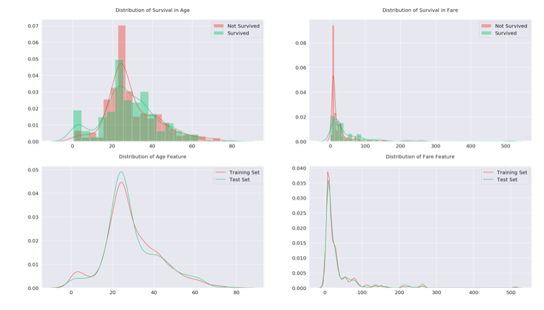

# Tests

<!-- toc -->

---

## Correlation

> 💡 Information about features with high correlation can be useful when filling missing values.

### Categorical vs. categorical

- Cramér's V
    
    A measure of association between two nominal variables (0 to 1). It is based on Pearson's chi-squared statistic.
    
    [https://datascience.stackexchange.com/questions/893/how-to-get-correlation-between-two-categorical-variable-and-a-categorical-variab](https://datascience.stackexchange.com/questions/893/how-to-get-correlation-between-two-categorical-variable-and-a-categorical-variab)
    
- Chi-square test / Pearson's chi-square test
    
    Assume two variables are independent and follows the uniform distribution.
    

### Categorical vs. numerical

- Correlation Ratio
- One-way ANOVA test

### Numerical vs. numerical

Pearson's correlation

`df.corr()`

## PPS

Predictive Power Score.

Score 0 = no linear/nonlinear predictive relationship

Score 1 = strong linear/nonlinear predictive relationship

Expect to find:

- Best univariate predictor
- Linear or nonlinear relationships

## Distribution

Distribution across features between train and test set!



One potential problem for both features is, the distribution has more spikes and bumps in training set, but it is smoother in test set. Model may not be able to generalize to test set because of this reason.

## Normality

- Histogram (eyeball)
- QQ plot (eyeball)
- Shapiro-Wilk
- Kolmogorov-Smirnov

```python
from scipy.stats import kstest, norm
my_data = norm.rvs(size=1000)
ks_statistic, p_value = kstest(my_data, 'norm')
print(ks_statistic, p_value)
```

## Multicollinearity

Multicollinearity occurs when there is a high correlation between the independent variables.

### Variance inflation factor

This metric quantifies the severity of multicollinearity in an ordinary least squares regression analysis.
